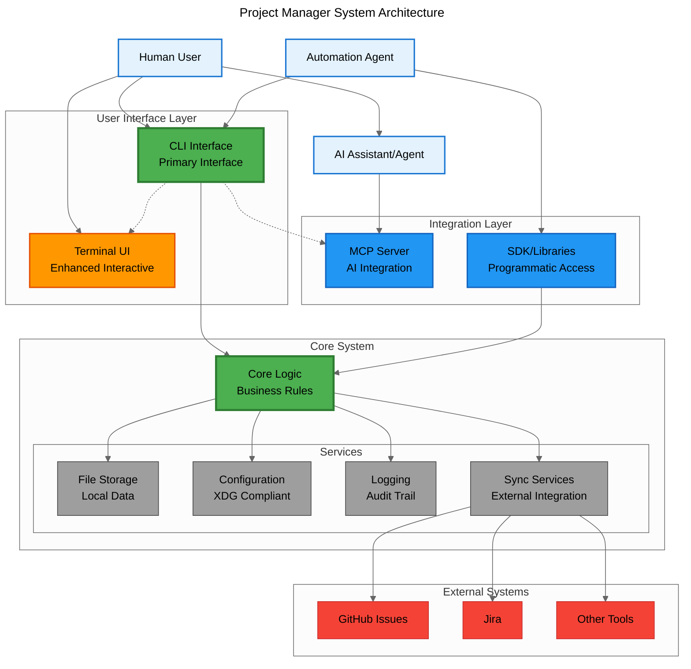

# ARCHITECTURE

## 1. Introduction

This document defines the architectural principles, system structure, and technical decisions for the Project Manager system. It serves as the technical blueprint that guides implementation decisions and provides a comprehensive view of the system's architecture.

## 2. System Overview

Project Manager is a local-first ticket management system designed to enable effective collaboration between developers and AI assistants through issue-based development workflows.

### 2.1. Core Components

- **CLI Interface**: Command-line tools for developer productivity
- **Local Storage**: File-based persistence for tickets, epics, and project data
- **MCP Server**: Model Context Protocol implementation for AI integration
- **External Integrations**: External tool-based synchronization with existing systems

## 3. Architectural Principles

### 3.1. Design Philosophy

- **Local-First Architecture**: All core functionality works offline with local data storage
- **AI-Driven Development**: Built specifically to support AI-assisted development workflows
- **Issue-Based Development**: Structured around tickets, epics, and implementation planning
- **Secure-by-Design**: Security considerations integrated into every architectural decision
- **Standards-First Approach**: Adopt industry standards over custom implementations
- **CLI-First Interface**: Command-line interface as the foundation for all other interfaces

### 3.2. Quality Principles

- **Shift-Left Development**: Early quality assurance through pre-implementation reviews
- **Document-Driven Development**: Specifications and design decisions captured before implementation
- **Test-Driven Development**: Comprehensive testing strategy from unit to integration levels
- **Domain-Driven Design**: Clear domain model with ubiquitous language
- **Separation of Concerns**: Clear distinction between architectural decisions and implementation status

## 4. System Architecture

### 4.1. Component Interaction Diagram

The following diagram illustrates the key components and their interaction patterns, emphasizing the CLI-first architecture where the CLI serves as the primary interface to the core business logic:



**Architecture Description:**
This diagram illustrates the CLI-first architecture where the CLI serves as the primary interface and foundation for all other components. The system emphasizes local-first design with external integration capabilities, supporting multiple user types including human developers, AI assistants, and automation agents.

**Key Architectural Patterns:**

- **CLI-First Design**: CLI serves as the primary interface and can launch/control other components like MCP server
- **Core System**: Contains business logic and shared configuration, ensuring consistent behavior across all interfaces
- **Actor-Based Interactions**: Human users, AI assistants, and automation agents interact through appropriate interfaces
- **Service-Oriented Architecture**: Core system coordinates various services (storage, configuration, logging, synchronization)
- **External Integration**: Synchronization services provide controlled access to external project management tools

**Interface Relationships:**

- **CLI → Core**: Primary interface accessing core business logic
- **CLI → TUI**: CLI can launch Terminal UI (e.g., `pm --tui`)
- **CLI → MCP**: CLI can launch and manage MCP server (e.g., `pm --mcp`)
- **SDK → Core**: Direct access to core for programmatic use
- Core maintains configuration and state, ensuring consistent behavior across all access patterns

### 4.2. Domain Model

#### Core Entities

**Project**

- Contains configuration and metadata
- Manages tickets, epics, and roadmaps
- Tracks contributors (human and AI)

**Ticket (Issue)**

- Represents a single development task
- Contains background, purpose, and acceptance criteria
- Tracks status, priority, and assignments
- Links to implementation plans and design proposals

**Epic**

- Groups related tickets into larger initiatives
- Defines business goals and success metrics
- Tracks progress across multiple tickets

**Implementation Plan**

- Documents technical approach for tickets
- Captures architectural decisions and alternatives
- Enables pre-implementation review and validation

#### Value Objects

**Status**: pending, in_progress, completed, archived
**Priority**: high, medium, low
**Type**: feature, bug, task, epic
**Privacy**: local-only, shareable, public

## 5. Technical Architecture

### 5.1. Technology Stack

**Runtime Environment**

- Node.js with ES modules
- TypeScript for type safety
- pnpm for package management (following npm ecosystem standards)

**CLI Framework (CLI-First Implementation)**

- Commander.js for command structure (following POSIX and GNU conventions)
- tsx for TypeScript execution
- Chalk for terminal styling

**Configuration Management (Standards Adoption)**

- XDG Base Directory specification for file locations
- JSON format for structured configuration
- Environment variable support following dotenv standards

**API Design (Standards Adoption)**

- RESTful principles with OpenAPI 3.0 specification
- JSON response format
- Standard HTTP status codes

**Code Quality (Standards Adoption)**

- ESLint/Prettier for JS/TS code style
- Conventional Commits for commit messages
- Semantic Versioning (SemVer 2.0.0) for releases

**Storage**

- JSON files for structured data
- CommonMark for Markdown documentation
- File-based templates

**AI Integration**

- Model Context Protocol (MCP) server (mandatory standard)
- Support for multiple AI providers
- Language bridging capabilities
- AI Resource Management (optional)
- Git-style co-authorship model for AI operations
- AI-optional design (all basic features work without AI)

### 5.2. Data Storage

**Local Storage Structure (XDG Base Directory Compliance)**

```
# Home directory structure
~/.config/project-manager/     # XDG Base Directory compliance
├── config.json              # Global configuration
├── projects/                # Project data
│   ├── {project-id}/       # Individual project
│   │   ├── project.json   # Project metadata
│   │   ├── tickets.json   # Ticket collection
│   │   ├── epics.json     # Epic collection
│   │   └── events.jsonl   # Event log (append-only)
│   └── index.json          # Cross-project index
├── ai/                      # AI Integration data
│   ├── sessions/           # AI session data
│   └── contexts/           # Cached contexts
└── sync/                    # External sync data
    ├── mappings/           # Entity mappings
    └── cache/              # External data cache

~/.cache/project-manager/      # XDG Base Directory compliance
└── [cache files]

~/.local/share/project-manager/ # XDG Base Directory compliance
└── [user data]

# Note: Project scope (global vs per-project) is under discussion
# and will be addressed in future architecture decisions
```

**Data Format**

- JSON for structured data (tickets, epics, configuration)
- Markdown for documentation and templates
- Timestamps for chronological ordering
- Lock files for concurrent access control (item-level granularity)
- **Version Control**: Snapshot-based storage initially, with future migration to diff-based storage
- **Co-authorship Tracking**: Record both AI agent and human instructor for all AI operations

## 6. Integration Architecture

### 6.1. MCP Server Implementation

**Core Services**

- Ticket management operations
- Project context retrieval
- AI-assisted validation workflows
- Language translation services

**API Endpoints**

- CRUD operations for tickets and epics
- Search and filtering capabilities
- Status reporting and analytics
- Template management

### 6.2. External System Integration

**Synchronization Strategy**

- External tool-based synchronization (not direct sync)
- User-driven conflict resolution with AI assistance
- Selective sharing based on privacy settings
- Audit trail for all changes

**Supported Systems**

- GitHub Issues
- Jira
- Linear
- Extensible plugin architecture

## 7. Security Architecture

### 7.1. Local Security

- File system permissions for data protection
- Secure storage of API keys and credentials
- Audit logging for all operations
- Privacy controls for sensitive information
- **AI Operation Safeguards**: User confirmation steps before AI executes destructive operations
- **Operation Risk Assessment**: Categorize operations by risk level (high/medium/low) to determine appropriate safeguards

### 7.2. Integration Security (Standards Adoption)

- OAuth 2.0 for external system authentication (industry standard)
- JWT tokens for secure API communication
- API key rotation and management
- Rate limiting and throttling
- Data sanitization and validation
- OWASP guidelines compliance for security practices

## 8. Development Guidelines

### 8.1. Implementation Approach

- **Domain-Driven Design**: Focus on core domain concepts
- **Test-Driven Development**: Tests before implementation
- **Document-Driven Development**: Clear specifications
- **AI-Assisted Development**: Leverage AI for efficiency
- **Standards-First Development**: Adopt industry standards over custom implementations
- **CLI-First Implementation**: Build CLI as primary interface to core business logic

### 8.2. Documentation and Decision Tracking

- **Architecture Decision Records (ADRs)**: Document significant architectural decisions
- **Decision-Implementation Separation**: ADRs track decisions, not implementation status
- **Implementation Tracking**: Use project management tools for implementation lifecycle
- **Clear Documentation Hierarchy**: Separate concerns across appropriate documents

### 8.3. Quality Assurance

- Comprehensive test coverage (unit, integration, E2E)
- Static analysis and linting
- Security scanning and vulnerability assessment
- Performance monitoring and optimization

## 9. Future Considerations

### 9.1. Scalability

- Plugin architecture for extensibility
- Multi-project support
- Team collaboration features
- Enterprise-grade security

### 9.2. User Experience (Phased Interface Implementation)

**Phase 1: CLI-First Implementation**

- Command-line interface as primary interaction method
- Structured output formats (JSON, plain text) for programmatic use
- Interactive and non-interactive modes

**Phase 2: Programmatic Interfaces**

- Model Context Protocol (MCP) server for AI integration
- RESTful API exposing core functionality
- SDK/libraries for common programming languages

**Phase 3: Additional User Interfaces (As Needed)**

- Terminal User Interface (TUI) for enhanced interactive experience
- IDE extensions (VSCode, IntelliJ) for integrated workflows
- Web UI for team collaboration and visualization
- Other interfaces based on user feedback and adoption patterns

### 9.3. AI Resource Management (Optional)

- Token usage monitoring dashboard
- Cross-project resource allocation
- Cost optimization algorithms
- Automatic context compression
- Model selection strategies
- Rate limit management
- Budget tracking and alerts

## 10. Related Documents

- [REQUIREMENTS.md](../domain/REQUIREMENTS.md) - User requirements that this architecture implements
- [CONTRIBUTING.md](../../CONTRIBUTING.md) - Development methodologies and guidelines
- [TEST_STRATEGY.md](../TEST_STRATEGY.md) - Comprehensive testing approach
- [CLAUDE.md](../../CLAUDE.md) - AI assistant project instructions and context
