# Context Map

This document visualizes the relationships between bounded contexts in the Project Manager system, following Domain-Driven Design principles. The context map helps teams understand dependencies, data flow, and integration patterns between different parts of the system.

## Overview

The Project Manager system is organized into three primary bounded contexts, each with distinct responsibilities and models:

```mermaid
%%{init: {"theme": "neutral", "themeVariables": {"primaryColor": "#4caf50", "primaryTextColor": "#2e7d32", "primaryBorderColor": "#2e7d32"}}}%%
graph TB
    %% System Boundary
    subgraph "Project Manager System"
        %% Bounded Contexts
        subgraph "Ticket Management Context"
            TM_P[Project]
            TM_T[Ticket]
            TM_E[Epic]
            TM_U[User]
            TM_IP[Implementation Plan]
        end

        subgraph "AI Integration Context"
            AI_A[AI Assistant]
            AI_C[AI Context]
            AI_DP[Design Proposal]
            AI_VR[Validation Result]
            AI_S[AI Session]
        end

        subgraph "External Sync Context"
            ES_EP[External Project]
            ES_SM[Sync Mapping]
            ES_ET[External Ticket]
            ES_SS[Sync Status]
        end

        subgraph "Shared Kernel"
            SK_UI[User Identity]
            SK_PID[Project ID]
            SK_TID[Ticket ID]
            SK_SV[Status Values]
            SK_PV[Priority Values]
        end
    end

    %% External Systems
    subgraph "External Systems"
        GH[GitHub Issues]
        JIRA[Jira]
        LINEAR[Linear]
        OTHER[Other PM Tools]
    end

    %% User Types
    subgraph "Users"
        DEV[Developer]
        PM[Project Manager]
        AI_USER[AI Assistant]
    end

    %% Context Relationships
    TM_T -.-> AI_A
    AI_VR -.-> TM_T
    TM_T -.-> ES_SM
    ES_ET -.-> TM_T

    %% External Integrations
    ES_SM --> GH
    ES_SM --> JIRA
    ES_SM --> LINEAR
    ES_SM --> OTHER

    %% User Interactions
    DEV --> TM_P
    PM --> TM_E
    AI_USER --> AI_A

    %% Shared Kernel Usage
    TM_P --> SK_PID
    TM_T --> SK_TID
    TM_T --> SK_SV
    AI_A --> SK_UI
    ES_SM --> SK_TID

    %% Styling
    classDef contextStyle fill:#e8f5e8,stroke:#4caf50,stroke-width:2px
    classDef sharedStyle fill:#e3f2fd,stroke:#2196f3,stroke-width:2px
    classDef externalStyle fill:#ffebee,stroke:#f44336,stroke-width:1px
    classDef userStyle fill:#fff3e0,stroke:#ff9800,stroke-width:2px
    classDef entityStyle fill:#f5f5f5,stroke:#757575,stroke-width:1px

    class TM_P,TM_T,TM_E,TM_U,TM_IP,AI_A,AI_C,AI_DP,AI_VR,AI_S,ES_EP,ES_SM,ES_ET,ES_SS entityStyle
    class SK_UI,SK_PID,SK_TID,SK_SV,SK_PV sharedStyle
    class GH,JIRA,LINEAR,OTHER externalStyle
    class DEV,PM,AI_USER userStyle
```



**Key Relationships:**
- **Customer/Supplier**: Ticket Management → AI Integration
- **Conformist**: External Sync → Ticket Management
- **Separate Ways**: AI Integration ↔ External Sync (minimal direct integration)

## Bounded Context Details

### 1. Ticket Management Context

**Responsibility**: Core project and ticket lifecycle management

**Core Concepts**:
- **Project**: Aggregate root containing tickets and configuration
- **Ticket**: Work item with status, priority, and dependencies
- **Epic**: Grouping of related tickets
- **User**: Human participants in the project
- **Implementation Plan**: Technical approach and design decisions

**Key Workflows**:
- Ticket creation and lifecycle management
- Epic planning and progress tracking
- Dependency management and resolution
- Implementation planning and documentation

**Autonomy Level**: High - Can function independently with local storage

### 2. AI Integration Context

**Responsibility**: AI assistant coordination and collaboration workflows

**Core Concepts**:
- **AI Assistant**: Autonomous AI participant in development
- **AI Context**: Shared knowledge and state for AI systems
- **Design Proposal**: Technical design requiring validation
- **Validation Result**: Outcome of AI expert review process
- **AI Session**: Bounded interaction between human and AI

**Key Workflows**:
- AI assistant task assignment and coordination
- Design proposal creation and validation
- Multi-AI collaboration and context sharing
- Translation and language bridging

**Autonomy Level**: Medium - Requires coordination with Ticket Management

### 3. External Sync Context

**Responsibility**: Integration with external project management systems

**Core Concepts**:
- **External Project**: Representation of project in external system
- **Sync Mapping**: Bidirectional mapping between internal and external entities
- **External Ticket**: External system's representation of our tickets
- **Sync Status**: State and health of synchronization processes

**Key Workflows**:
- Bidirectional synchronization with GitHub Issues, Jira, etc.
- Conflict resolution and data mapping
- Privacy-aware selective sharing
- External system authentication and authorization

**Autonomy Level**: Low - Dependent on external systems and internal contexts

## Context Relationships

### Ticket Management ↔ AI Integration

**Relationship Type**: Customer/Supplier

**Integration Pattern**:
- **Ticket Management** is the **Customer** (upstream)
- **AI Integration** is the **Supplier** (downstream)

**Data Flow**:
- Ticket Management provides tickets and implementation plans to AI Integration
- AI Integration returns validation results and AI-generated proposals
- AI Integration updates ticket status based on AI work completion

**Anti-Corruption Layer**:
- AI Integration translates ticket concepts into AI-specific context
- Validation results are translated back to ticket management concepts

**Key Integration Points**:
```
Ticket Management → AI Integration:
- Ticket assignment to AI Assistant
- Implementation plan validation requests
- Context sharing for AI decision making

AI Integration → Ticket Management:
- Validation results and feedback
- AI-generated design proposals
- Ticket status updates from AI work
```

### Ticket Management ↔ External Sync

**Relationship Type**: Conformist

**Integration Pattern**:
- **External Sync** conforms to **Ticket Management** model
- External systems are adapted to internal model via mapping

**Data Flow**:
- Ticket Management provides tickets for external synchronization
- External Sync translates between internal and external representations
- External changes are pulled and mapped to internal model

**Anti-Corruption Layer**:
- External Sync protects Ticket Management from external system changes
- Data mapping layer handles format and terminology differences

**Key Integration Points**:
```
Ticket Management → External Sync:
- Tickets marked for external sharing
- Project configuration and sync preferences
- Privacy and access control settings

External Sync → Ticket Management:
- External changes and updates
- Conflict resolution proposals
- Sync status and health reports
```

### AI Integration ↔ External Sync

**Relationship Type**: Separate Ways

**Integration Pattern**:
- Minimal direct integration
- Coordination happens through Ticket Management context

**Rationale**:
- AI Integration focuses on internal development workflows
- External Sync focuses on external system coordination
- Direct integration would create unnecessary coupling

**Indirect Coordination**:
- AI-generated content can be shared externally via Ticket Management
- External feedback can influence AI validation through ticket updates

## Shared Kernel

**Shared Concepts** (used across all contexts):

### Identity Values
- **User Identity**: Unique identifier for human participants
- **Project ID**: Unique identifier for projects across all contexts
- **Ticket ID**: Unique identifier for tickets across all contexts

### Enumeration Values
- **Status Values**: `pending`, `in_progress`, `completed`, `archived`
- **Priority Values**: `high`, `medium`, `low`
- **Privacy Levels**: `local-only`, `shareable`, `public`

### Event Types
- **Ticket Events**: Created, Updated, Completed, Archived
- **User Events**: Added, Removed, Role Changed
- **Project Events**: Created, Configured, Archived

## Evolution Strategy

### Context Independence
Each bounded context should be able to evolve its internal model independently, with well-defined interfaces managing cross-context communication.

### Interface Stability
Changes to shared kernel require coordination across all contexts. Interface changes should be versioned and backward-compatible when possible.

### Future Context Addition
New bounded contexts (e.g., Reporting, Analytics) can be added without modifying existing contexts by following the established integration patterns.

## Interface Architecture Integration

### CLI-First Interface Design

All bounded contexts are accessed through a unified CLI-first interface architecture:

**Primary Interface**:
- **CLI**: Single source of truth for all business logic
- All contexts coordinate through CLI commands
- Structured output formats (JSON, plain text) for programmatic use

**Additional Interfaces**:
- **MCP Server**: Launched via CLI for AI Integration context
- **TUI**: Launched via CLI for enhanced user experience
- **SDK**: Direct core access for programmatic integration

**Interface-Context Mapping**:
```
CLI → All Contexts (primary access)
MCP Server → AI Integration Context (AI assistant coordination)
TUI → Ticket Management Context (interactive ticket management)
SDK → All Contexts (direct programmatic access)
```

### Standards Compliance

All contexts follow industry standards:
- **Configuration**: XDG Base Directory specification
- **APIs**: RESTful principles with OpenAPI specification (if implemented)
- **CLI**: POSIX and GNU conventions
- **Documentation**: CommonMark for Markdown
- **Versioning**: Semantic Versioning (SemVer)

## Implementation Guidance

### Team Organization
- **Ticket Management**: Core platform team
- **AI Integration**: AI/ML specialists
- **External Sync**: Integration specialists
- **Interface Layer**: CLI and integration specialists

### Technology Boundaries
- Each context can choose appropriate technology stacks
- Integration happens through CLI-first interface architecture
- Shared kernel implemented as shared libraries/modules
- All interfaces follow industry standards

### Testing Strategy
- Unit tests within each context
- Integration tests at context boundaries
- Contract tests for external integrations
- CLI interface tests for all context interactions

## Related Documentation

- [Architecture Overview](./README.md) - High-level architectural principles
- [Domain Documentation](../domain/README.md) - Business domain concepts
<!-- TODO: Implement context implementation details documentation -->
- [Ubiquitous Language](../domain/UBIQUITOUS_LANGUAGE.md) - Domain terminology
