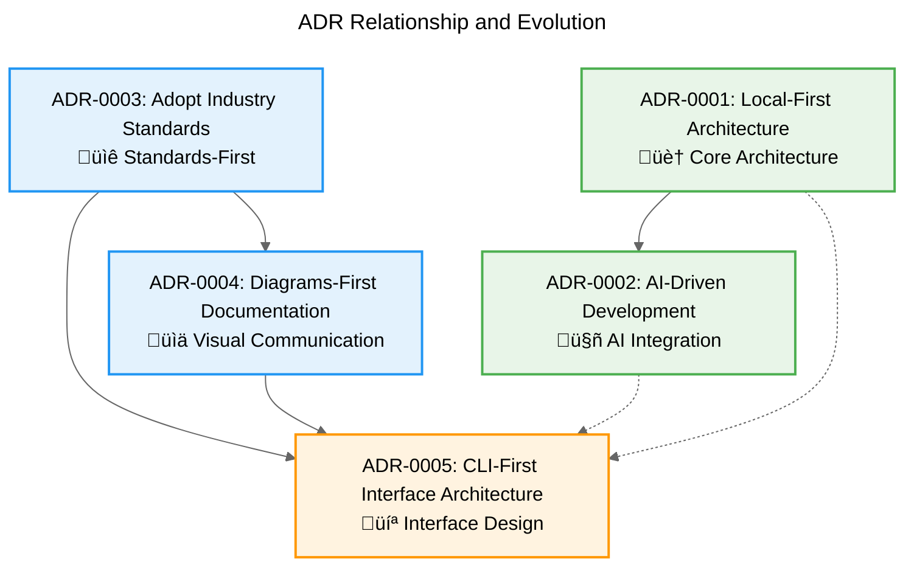

# Architecture Decision Records (ADR)

> **Note**: For ADR creation guidelines and workflow integration, see [CONTRIBUTING.md](../../CONTRIBUTING.md).

This directory contains Architecture Decision Records (ADRs) for the Project Manager system. ADRs document the significant architectural decisions made during development, including the context, rationale, and consequences of each decision.

## What are ADRs?

An Architecture Decision Record (ADR) is a document that captures an important architectural decision made along with its context and consequences. ADRs help preserve the reasoning behind architectural choices and provide future developers with the context needed to understand why certain decisions were made.

## ADR Format

All ADRs in this project follow a standardized format defined in [`TEMPLATE.md`](./TEMPLATE.md). Each ADR includes:

- **Status:** Current state of the decision (Proposed, Accepted, Deprecated, Superseded)
- **Context:** The circumstances that led to this decision
- **Decision:** The specific choice made and its rationale
- **Consequences:** Expected positive and negative outcomes
- **Alternatives:** Other options considered and why they were rejected
- **Related Decisions:** Links to other ADRs or documents
- **Scope:** Which parts of the system are affected
- **Implementation Notes:** Practical guidance for implementation
- **Tags:** Keywords for categorization and search

## Naming Convention

ADRs are named using the following pattern:
```
NNNN-short-decision-title.md
```

Where:
- `NNNN` is a zero-padded sequential number (e.g., 0001, 0002, 0003)
- `short-decision-title` is a kebab-case summary of the decision

## Current ADRs

### ADR Relationship Diagram

The following diagram shows the relationships and dependencies between current ADRs:



### ADR Index

| ADR | Status | Title | Description |
|-----|--------|-------|-------------|
| [0001](./0001-local-first-architecture.md) | Accepted | Local-First Architecture | Define local-first principles and data storage approach |
| [0002](./0002-ai-driven-development-architecture.md) | Accepted | AI-Driven Development Architecture | Framework for AI assistant integration and collaboration |
| [0003](./0003-adopt-industry-standards.md) | Accepted | Adopt Industry Standards | Prefer established standards over custom implementations |
| [0004](./0004-diagrams-first-documentation.md) | Accepted | Diagrams-First Documentation | Use Mermaid for visual specification documentation |
| [0005](./0005-cli-first-interface-architecture.md) | Proposed | CLI-First Interface Architecture | Command-line interface as foundation for all other interfaces |

**Legend:**
- 📋 Process and workflow decisions
- 🏠 Core architectural principles
- 🤖 AI integration and automation
- 📐 Standards and conventions
- 📊 Documentation and communication
- 💻 Interface and user experience

## Tools and Resources

### Template Usage
To create a new ADR:
1. Copy the [`TEMPLATE.md`](./TEMPLATE.md) file
2. Rename following the naming convention
3. Replace placeholder text with actual content
4. Update the ADR index in this README

## References

- [ADR GitHub Organization](https://adr.github.io/) - Community resources and tools
- [Architecture Decision Records by Michael Nygard](https://cognitect.com/blog/2011/11/15/documenting-architecture-decisions)
- [Project Manager Architecture](../ARCHITECTURE.md) - System architecture context
- [CONTRIBUTING.md](../../../CONTRIBUTING.md) - ADR creation guidelines and workflow integration
