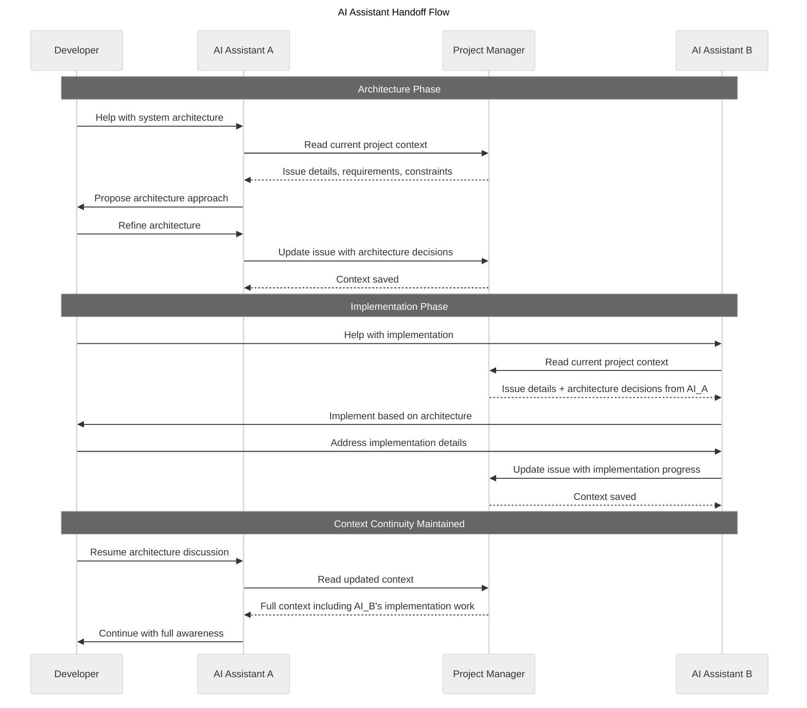
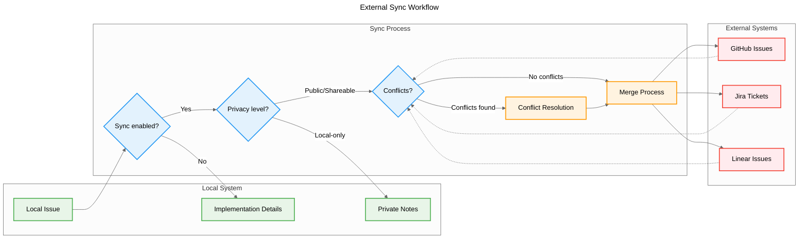

# USER STORIES AND USE CASES

> ⚠️ **IMPORTANT**: This document describes conceptual workflows and requirements. All interfaces, command names, data structures, and terminology are **provisional** and subject to change during design and implementation phases. The focus is on capturing user needs and use cases, not final specifications.

## User Personas

### 1. AI-Driven Developer
- Uses AI assistants daily for development
- Struggles with context loss during long sessions
- Wants to maintain project momentum

### 2. Tech Lead
- Reviews implementation plans from team
- Coordinates between multiple developers and AI assistants
- Needs visibility into project progress

### 3. OSS Contributor
- Works on multiple projects simultaneously
- Collaborates with international teams
- Needs to sync local work with upstream projects

### 4. AI Assistant (Claude/Gemini)
- Processes developer requests
- Needs context from previous sessions
- Must understand project state and priorities

## User Stories

### Context Management

**US-001**: As an AI-driven developer, I want to create issues with full context so that AI assistants understand the complete picture when I return to a task.
- **Given** I'm starting a new feature
- **When** I create an issue with background and goals
- **Then** Any AI assistant can understand the context

**US-002**: As an AI assistant, I want to access project history and current state so that I can provide relevant help without losing track of objectives.
- **Given** A developer asks for help
- **When** I query the project state
- **Then** I receive current issues, priorities, and context

### Implementation Planning

**US-003**: As a developer, I want to document implementation plans before coding so that I can get feedback from teammates and AI.
- **Given** I have a complex feature to implement
- **When** I create a design proposal
- **Then** Others can review and suggest improvements

**US-004**: As a tech lead, I want to review implementation approaches before work begins so that we avoid costly mistakes.
- **Given** A team member proposes an implementation
- **When** I access the proposal
- **Then** I can provide feedback before coding starts

### Multi-AI Collaboration

**US-005**: As a developer, I want different AI assistants to share context so that I can leverage each AI's strengths.
- **Given** I'm using Claude for architecture and Gemini for optimization
- **When** I switch between assistants
- **Then** Both have access to the same project context

**US-006**: As an AI assistant, I want to see what other AIs have contributed so that I can build on their work.
- **Given** Another AI has worked on the project
- **When** I access the project
- **Then** I can see previous AI contributions and decisions

### Issue Lifecycle

**US-007**: As a developer, I want to track issue progress so that I know what's been done and what's pending.
- **Given** I have multiple issues in progress
- **When** I check project status
- **Then** I see clear progress indicators

**US-008**: As a developer, I want to organize issues into epics and milestones so that I can manage larger initiatives.
- **Given** I'm working on a major feature
- **When** I create related issues
- **Then** I can group them meaningfully

### External Integration

**US-009**: As an OSS contributor, I want to sync local issues with GitHub Issues so that I can work offline and share selectively.
- **Given** I have local implementation plans
- **When** I'm ready to share publicly
- **Then** I can push selected issues to GitHub

**US-010**: As a team member, I want to pull issues from Jira/Linear so that I can work locally with full context.
- **Given** My team uses external tools
- **When** I start local development
- **Then** I can import relevant issues

### AI Resource Management (Optional)

Optional stories addressing token limits, rate limits, and budget constraints when working with AI assistants.

**US-011**: As a developer using AI assistants, I want visibility into resource usage so that I can manage token limits and costs.
- **Given** I'm working with AI assistants
- **When** I approach token or rate limits
- **Then** I can see usage and adjust my approach

**US-012**: As a developer, I want the system to optimize context for AI models so that essential information fits within token limits.
- **Given** My project context exceeds model limits
- **When** I request AI assistance
- **Then** The most relevant context is prioritized

**US-013**: As a team lead, I want to allocate AI resources across multiple projects so that teams can work efficiently within budgets.
- **Given** Multiple projects using AI assistants
- **When** Resources are limited
- **Then** I can prioritize and allocate fairly

## User Flow Diagrams

### Developer Daily Workflow

The following diagram shows the typical daily workflow for a developer using the Project Manager system:

```mermaid
---
title: Developer Daily Workflow
---
%%{init: {"theme": "neutral", "themeVariables": {"primaryColor": "#4caf50", "primaryTextColor": "#2e7d32", "primaryBorderColor": "#2e7d32"}}}%%
flowchart TD
    START([Start Development Session])
    
    %% Issue Selection
    CHECK_ISSUES[Check current issues]
    SELECT_ISSUE[Select high-priority task]
    
    %% AI Collaboration
    AI_READS[AI reads issue context]
    WORK_WITH_AI[Work with AI on implementation]
    
    %% Progress Updates
    UPDATE_PROGRESS[Update progress in issue]
    CREATE_CHILD[Create child issues for discoveries]
    
    %% Session End
    PRESERVE_CONTEXT[Preserve context for next session]
    END([End Session])
    
    %% Decision Points
    NEED_REVIEW{Need design review?}
    TASK_COMPLETE{Task complete?}
    NEW_DISCOVERIES{New discoveries?}
    
    %% Review Process
    CREATE_PROPOSAL[Create design proposal]
    AI_REVIEW[AI provides feedback]
    TEAM_REVIEW[Team reviews proposal]
    INCORPORATE_FEEDBACK[Incorporate feedback]
    
    %% Flow
    START --> CHECK_ISSUES
    CHECK_ISSUES --> SELECT_ISSUE
    SELECT_ISSUE --> NEED_REVIEW
    
    NEED_REVIEW -->|Yes| CREATE_PROPOSAL
    CREATE_PROPOSAL --> AI_REVIEW
    AI_REVIEW --> TEAM_REVIEW
    TEAM_REVIEW --> INCORPORATE_FEEDBACK
    INCORPORATE_FEEDBACK --> AI_READS
    
    NEED_REVIEW -->|No| AI_READS
    AI_READS --> WORK_WITH_AI
    WORK_WITH_AI --> UPDATE_PROGRESS
    UPDATE_PROGRESS --> NEW_DISCOVERIES
    
    NEW_DISCOVERIES -->|Yes| CREATE_CHILD
    CREATE_CHILD --> TASK_COMPLETE
    NEW_DISCOVERIES -->|No| TASK_COMPLETE
    
    TASK_COMPLETE -->|No| WORK_WITH_AI
    TASK_COMPLETE -->|Yes| PRESERVE_CONTEXT
    PRESERVE_CONTEXT --> END
    
    %% Styling
    classDef startEnd fill:#4caf50,stroke:#2e7d32,stroke-width:2px,color:#fff
    classDef process fill:#e8f5e8,stroke:#4caf50,stroke-width:2px
    classDef decision fill:#fff3e0,stroke:#ff9800,stroke-width:2px
    classDef review fill:#e3f2fd,stroke:#2196f3,stroke-width:2px
    
    class START,END startEnd
    class CHECK_ISSUES,SELECT_ISSUE,AI_READS,WORK_WITH_AI,UPDATE_PROGRESS,CREATE_CHILD,PRESERVE_CONTEXT process
    class NEED_REVIEW,TASK_COMPLETE,NEW_DISCOVERIES decision
    class CREATE_PROPOSAL,AI_REVIEW,TEAM_REVIEW,INCORPORATE_FEEDBACK review
```

### AI Assistant Handoff Flow

This diagram shows how context is maintained when switching between different AI assistants:

### External Sync Workflow

This diagram illustrates how local issues synchronize with external systems:

## Use Cases

### UC-1: Starting a New Feature

**Actor**: Developer
**Precondition**: Project is initialized
**Flow**:
1. Developer creates an epic for the feature
2. Developer breaks down into issues with context
3. Developer documents implementation approach
4. Developer requests AI review
5. AI analyzes proposal and provides feedback
6. Developer refines based on feedback
7. Developer begins implementation

### UC-2: AI Handoff

**Actor**: Developer, AI Assistant A, AI Assistant B
**Precondition**: Issue exists with context
**Flow**:
1. Developer works with AI Assistant A on architecture
2. AI Assistant A updates issue with decisions
3. Developer switches to AI Assistant B
4. AI Assistant B reads issue context
5. AI Assistant B continues from current state
6. Both AIs maintain shared understanding

### UC-3: Design Review Workflow

**Actor**: Developer, Tech Lead, AI Assistant
**Precondition**: Complex feature needs implementation
**Flow**:
1. Developer creates design proposal issue
2. Developer adds technical approach and alternatives
3. AI Assistant provides initial feedback
4. Tech Lead reviews proposal
5. Team discusses tradeoffs
6. Decision is documented
7. Implementation proceeds with confidence

### UC-4: Daily Development Flow

**Actor**: Developer, AI Assistant
**Precondition**: Active project with issues
**Flow**:
1. Developer checks current issues
2. Developer selects high-priority task
3. AI Assistant reads issue context
4. Developer and AI work on implementation
5. Progress is updated in issue
6. New discoveries create child issues
7. Context is preserved for next session

### UC-5: Cross-Project Synchronization

**Actor**: OSS Contributor
**Precondition**: Local and remote repositories exist
**Flow**:
1. Contributor imports issues from GitHub
2. Contributor adds local implementation details
3. Contributor works offline with full context
4. Contributor syncs completed work
5. GitHub Issues are updated
6. Local private notes remain local

### UC-6: AI Resource Management (Optional)

**Actor**: Developer using multiple AI assistants
**Precondition**: Working with AI assistants that have token/rate limits
**Flow**:
1. Developer starts working with premium AI model
2. System tracks token usage during session
3. As limits approach, developer receives notification
4. Developer can continue with reduced model or pause
5. Context is optimized to fit in smaller windows
6. Work continues with minimal disruption
7. Resource usage is visible for planning

## Acceptance Criteria

### For Context Preservation
- Issues contain sufficient context for any reader
- AI assistants can understand project state without extensive prompting
- Context survives across sessions and assistants

### For Shift-Left Development
- Implementation approaches are documented before coding
- Reviews happen on designs, not just code
- Problems are caught during planning phase

### For Collaboration
- Multiple AI assistants work from shared context
- Human and AI contributions are clearly tracked
- Handoffs between actors are seamless

### For Integration
- Local and remote systems stay synchronized
- Conflicts are detected and resolved
- Private information remains local
