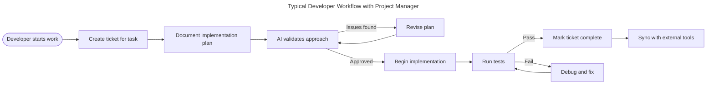
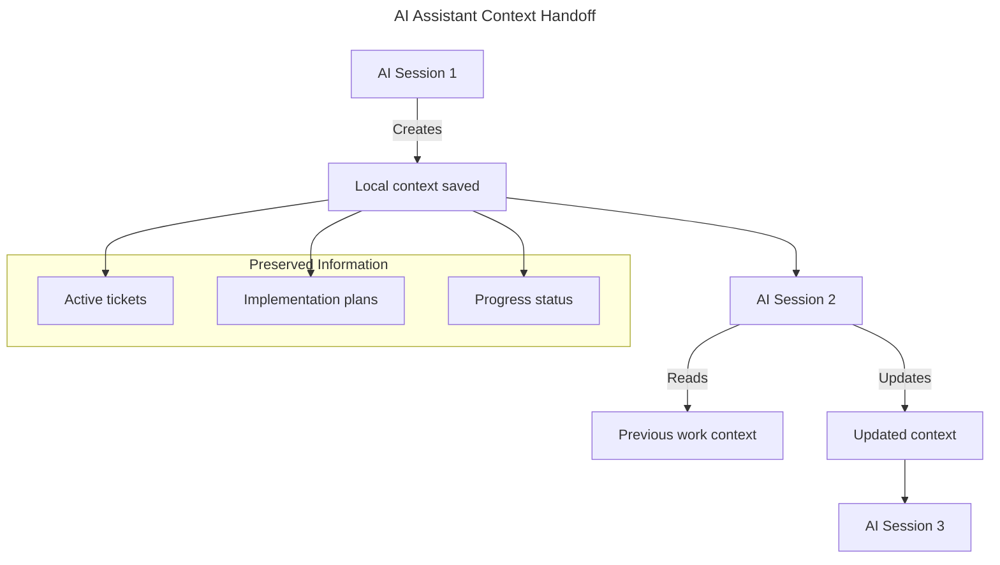
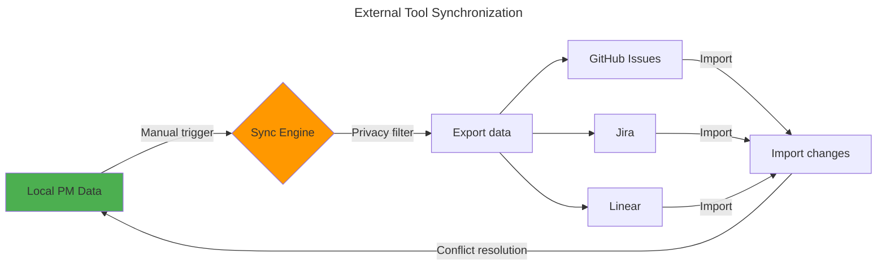
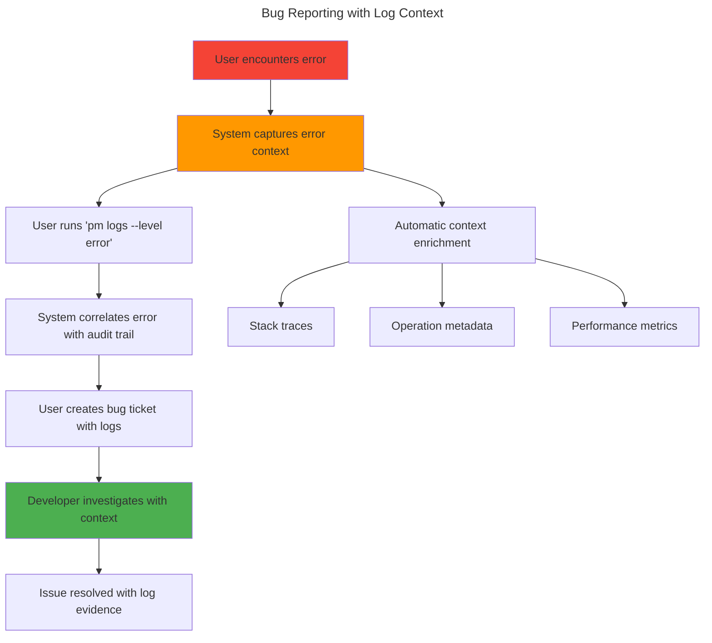
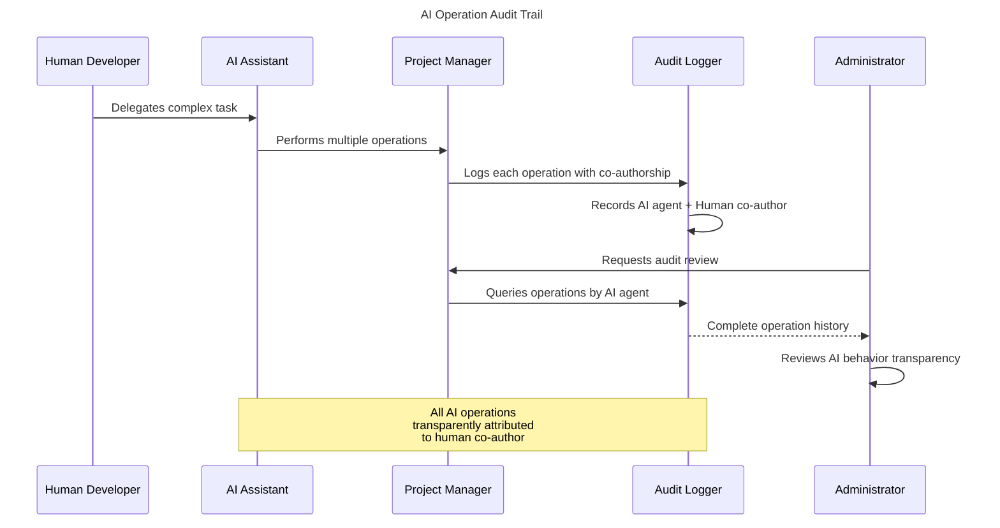

# USER STORIES AND USE CASES

> ⚠️ **IMPORTANT**: This document describes conceptual workflows and requirements. All interfaces, command names, data structures, and terminology are **provisional** and subject to change during design and implementation phases. The focus is on capturing user needs and use cases, not final specifications.

## User Personas

### 1. AI-Driven Developer

- Uses AI assistants daily for development
- Struggles with context loss during long sessions
- Wants to maintain project momentum

### 2. Tech Lead

- Reviews implementation plans from team
- Coordinates between multiple developers and AI assistants
- Needs visibility into project progress

### 3. OSS Contributor

- Works on multiple projects simultaneously
- Collaborates with international teams
- Needs to sync local work with upstream projects

### 4. AI Assistant (Claude/Gemini)

- Processes developer requests
- Needs context from previous sessions
- Must understand project state and priorities

### 5. Multi-Device Developer

- Works across multiple development machines (laptop, desktop, remote servers)
- Switches between devices frequently during development
- Needs seamless context preservation across devices
- Collaborates with AI assistants from different machines
- Values offline development capability on each device

### 6. Bug Reporter/System Administrator

- Encounters system issues during usage
- Needs to gather diagnostic information quickly
- Reports bugs to development team with context
- Monitors system health and performance
- Investigates security incidents and compliance issues

## User Workflow Diagrams

### Developer Workflow

### AI Assistant Handoff Flow

### External Synchronization Flow

### Bug Reporting and Diagnosis Flow

### AI Operation Transparency Flow

## Functional Use Cases

### UC-1: Create New Issue with AI Assistance

**Actor**: AI-Driven Developer
**Precondition**: Project initialized
**Postcondition**: Issue created with implementation plan

#### Main Flow

1. Developer describes task to AI assistant
2. AI creates issue with:
   - Title and description
   - Acceptance criteria
   - Implementation plan
3. Developer reviews and approves
4. Issue saved to local storage
5. Issue optionally synced to external tools

#### Alternative Flows

- 2a. AI requests clarification
  - Developer provides additional context
  - Return to step 2
- 3a. Developer requests changes
  - AI revises issue
  - Return to step 3

### UC-2: Resume Work After Context Switch

**Actor**: AI-Driven Developer + AI Assistant
**Precondition**: Previous work session exists
**Postcondition**: Development continues with full context

#### Main Flow

1. Developer starts new AI session
2. AI loads project context
3. AI summarizes:
   - Current active issues
   - Recent progress
   - Pending decisions
4. Developer selects issue to work on
5. AI retrieves full issue context
6. Development continues

### UC-3: Tech Lead Review

**Actor**: Tech Lead
**Precondition**: Team members have created issues
**Postcondition**: Issues reviewed and feedback provided

#### Main Flow

1. Tech lead opens project dashboard
2. System displays:
   - Pending reviews
   - Implementation plans
   - Progress metrics
3. Tech lead selects issue for review
4. Reviews implementation approach
5. Provides feedback or approval
6. Notification sent to developer

### UC-4: OSS Contribution Workflow

**Actor**: OSS Contributor
**Precondition**: Forked repository with local changes
**Postcondition**: Changes synchronized with upstream

#### Main Flow

1. Contributor creates local issues
2. Implements features/fixes
3. Marks issues complete
4. Initiates sync with upstream
5. System maps local issues to:
   - GitHub Issues
   - Pull Request descriptions
6. Creates upstream PR with context

## Non-Functional Use Cases

### UC-5: Offline Development

**Actor**: Any Developer
**Trigger**: Network connection lost
**Expected**: All core features remain functional

- Create/edit issues
- Update progress
- Access all local data
- Queue sync operations

### UC-6: Multi-Language Support

**Actor**: Non-English Developer
**Trigger**: Developer uses native language
**Expected**: AI bridges language gap

- Commands in native language
- Translated to English for storage
- External sync in English
- Local display in native language

### UC-7: AI Context Optimization

**Actor**: AI Assistant
**Trigger**: Context size exceeds limits
**Expected**: Intelligent context management

- Compress historical data
- Prioritize recent/relevant info
- Maintain issue relationships
- Preserve decision history

### UC-8: Bug Report with Log Context

**Actor**: Bug Reporter (Developer/User)
**Precondition**: User encounters an error or unexpected behavior
**Postcondition**: Bug report created with relevant diagnostic information

#### Main Flow

1. User encounters system error or unexpected behavior
2. System automatically captures error context in logs
3. User runs log command to gather recent error logs
4. System displays relevant error entries with context:
   - Error messages and stack traces
   - Operation sequence leading to error
   - System state and metadata
   - Performance metrics during error period
5. User creates bug ticket with:
   - Description of unexpected behavior
   - Steps to reproduce
   - Attached log excerpt with error context
6. System correlates error logs with audit trail for complete picture

#### Alternative Flows

- 2a. Error occurs without logging context
  - User manually describes issue
  - System searches logs based on timestamp and description
  - Provides best-effort log correlation

### UC-9: Performance Investigation

**Actor**: System Administrator/Tech Lead
**Precondition**: System performance degradation reported
**Postcondition**: Performance bottleneck identified and documented

#### Main Flow

1. User reports slow system response
2. Administrator runs `pm logs --level info --operation "ticket.create"` to analyze specific operations
3. System displays operation timing and metadata:
   - Use case execution duration
   - Database operation times
   - File I/O statistics
   - Memory usage patterns
4. Administrator identifies operations exceeding normal thresholds
5. Creates performance investigation ticket with:
   - Specific slow operations identified
   - Performance metrics and trends
   - Log evidence of bottlenecks
6. Schedules optimization work based on findings

### UC-10: Security Audit Trail

**Actor**: Security Auditor/Compliance Officer
**Precondition**: Security audit or compliance review required
**Postcondition**: Complete operation history provided for review

#### Main Flow

1. Auditor initiates security review
2. Runs audit command to gather operation history
3. System generates comprehensive audit report showing:
   - All system operations by specific user
   - Timestamps and operation types
   - Data changes (before/after states)
   - Source of operations (CLI, API, AI-assisted)
   - Co-authorship information for AI operations
4. Auditor reviews for:
   - Unauthorized access patterns
   - Data modification compliance
   - Segregation of duties
   - AI operation transparency
5. Generates compliance report with audit evidence

### UC-11: AI Operation Transparency

**Actor**: AI-Driven Developer/Compliance Officer
**Precondition**: AI assistant performs operations on user's behalf
**Postcondition**: All AI actions are transparently logged and attributable

#### Main Flow

1. Developer delegates task to AI assistant
2. AI assistant performs multiple operations:
   - Creates tickets
   - Updates status
   - Modifies content
3. System logs each AI operation with:
   - AI agent identification
   - Human co-author attribution
   - Operation context and reasoning
   - Input prompts and responses
4. Developer can review AI actions via:
   - Run log command and filter by AI operations
   - Run audit command for comprehensive history
5. Full transparency maintained for:
   - Regulatory compliance
   - Trust verification
   - Debugging AI behavior
   - Training data for AI improvement

#### Alternative Flows

- 3a. AI operation fails
  - Error logged with full context
  - Human co-author notified
  - Rollback capability maintained

### UC-12: Development Environment Debugging

**Actor**: AI-Driven Developer
**Precondition**: Developer encounters unexpected behavior during development
**Postcondition**: Issue resolved with comprehensive debugging information

#### Main Flow

1. Developer experiences unexpected CLI behavior
2. Checks real-time console output with structured logging (pino-pretty format)
3. Reviews persistent logs via log command with `NODE_ENV=developmen` environment
4. System provides comprehensive debugging context:
   - Use case execution flow
   - Parameter values and transformations
   - Database queries and responses
   - File system operations
   - Error propagation path
5. Developer identifies root cause from log analysis
6. Creates fix and verifies through log output

#### Alternative Flows

- 4a. Log information insufficient
  - Developer temporarily increases log level to trace
  - Re-executes failing operation
  - Captures detailed execution trace

### UC-13: Multi-Device Project Synchronization

**Actor**: Multi-Device Developer
**Precondition**: Developer has Project Manager installed on multiple devices
**Postcondition**: Project data synchronized across all devices with consistent state

#### Main Flow

1. Developer creates tickets and makes progress on Device A
2. Switches to Device B for continued development
3. Initiates sync operation between devices
4. System performs device-to-device synchronization:
   - Identifies changes since last sync using ULID timestamps
   - Merges new tickets, updates, and status changes
   - Resolves conflicts using causal ordering from ULID timestamps
   - Preserves all device-specific preferences and configurations
5. Developer continues work seamlessly on Device B with full context
6. All changes propagate back to Device A on next sync

#### Alternative Flows

- 3a. Network unavailable between devices
  - System queues sync operations for later execution
  - Developer can continue working offline on Device B
  - Sync completes automatically when connectivity restored
- 4a. Conflicting changes detected
  - System presents conflict resolution options
  - Developer chooses resolution strategy (merge, take latest, manual)
  - Conflict resolution preserved for similar future conflicts

### UC-14: Offline Distributed Development

**Actor**: Multi-Device Developer + AI Assistant
**Precondition**: Multiple devices working offline on the same project
**Postcondition**: All offline changes successfully merged without data loss

#### Main Flow

1. Developer works offline on Device A, creating tickets T1 and T2
2. Simultaneously, AI assistant on Device B creates tickets T3 and T4 offline
3. Both devices come back online and initiate synchronization
4. System uses ULID causal ordering to merge changes:
   - Establishes temporal sequence: T1 → T2 → T3 → T4
   - No conflicts as each ticket has unique ULID
   - Project state reflects all changes in causally correct order
5. Both devices now have complete, consistent project state
6. Developer and AI can continue collaborative work

#### Alternative Flows

- 4a. Same ticket modified on both devices
  - System detects concurrent modifications using ULID timestamps
  - Applies conflict resolution strategy (last-write-wins with causal ordering)
  - Creates audit trail of conflict resolution decisions

### UC-15: Cross-Device AI Context Sharing

**Actor**: Multi-Device Developer + AI Assistant
**Precondition**: Developer uses AI assistants across multiple devices
**Postcondition**: AI maintains consistent context regardless of device

#### Main Flow

1. Developer starts AI-assisted development session on Device A
2. AI creates implementation plan and begins work on tickets
3. Developer switches to Device B and starts new AI session
4. AI loads synchronized project context from Device A:
   - Previous implementation decisions and rationale
   - Current ticket states and progress
   - AI conversation history and context
   - Pending decisions and open questions
5. AI continues seamlessly with full context on Device B
6. All AI actions and decisions sync back to Device A

#### Alternative Flows

- 4a. Partial sync available
  - AI works with available context
  - Requests missing information from developer
  - Updates context as more data becomes available
- 2a. AI context becomes too large
  - System compresses historical context
  - Preserves critical decisions and current state
  - Maintains performance while preserving essential information

## Acceptance Criteria

### For Developers

- Can create issue in < 2 minutes
- Context preserved across sessions
- Works offline without degradation
- Integrates with existing workflow

### For Tech Leads

- Full visibility into team progress
- Can review plans before implementation
- Metrics and reporting available
- Easy delegation and assignment

### For OSS Contributors

- Seamless upstream synchronization
- Maintains contribution standards
- Supports multiple projects
- Preserves attribution

### For AI Assistants

- Complete context availability
- Structured data format
- Clear task boundaries
- Validation capabilities

### For Multi-Device Developers

- Seamless context switching between devices
- Conflict-free synchronization in < 30 seconds
- Offline development with full functionality
- No data loss during device transitions
- AI context preserved across devices

### For Bug Reporters and System Administrators

- Can generate diagnostic logs in < 30 seconds
- Error context automatically captured and correlated
- Log viewing and filtering works intuitively
- Performance bottlenecks identifiable from logs
- No sensitive information exposed in logs

### For Security Auditors and Compliance Officers

- Complete audit trail for all operations
- AI operations transparently attributable to humans
- Tamper-proof logging system
- Configurable data retention periods
- GDPR/compliance-ready data handling

## Success Metrics

- **Efficiency**: 50% reduction in context switching time
- **Quality**: 80% first-pass implementation success
- **Adoption**: Used in 90% of AI-assisted tasks
- **Reliability**: 99.9% data integrity maintained
- **Multi-Device Efficiency**: 70% reduction in device transition overhead
- **Synchronization Reliability**: 99.99% conflict-free merge rate
- **Offline Capability**: 100% functionality available without network
- **Cross-Device AI Context**: 90% context preservation across devices
- **Debugging Effectiveness**: 70% reduction in time to identify bugs with log context
- **Audit Compliance**: 100% operation traceability for compliance requirements
- **Performance Monitoring**: < 5% system overhead from logging operations
- **Security Transparency**: Zero sensitive data exposure in logs

---

> **Note**: This document will evolve as we gather more user feedback and refine our understanding of user needs. Implementation details will be specified in technical design documents.
