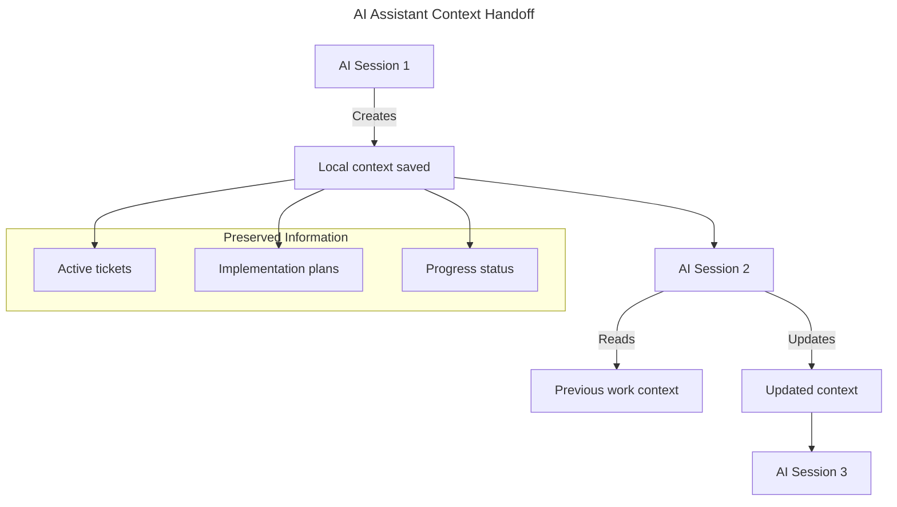
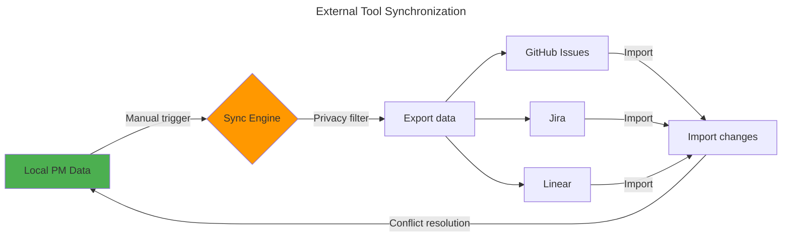

# USER STORIES AND USE CASES

> ⚠️ **IMPORTANT**: This document describes conceptual workflows and requirements. All interfaces, command names, data structures, and terminology are **provisional** and subject to change during design and implementation phases. The focus is on capturing user needs and use cases, not final specifications.

## User Personas

### 1. AI-Driven Developer

- Uses AI assistants daily for development
- Struggles with context loss during long sessions
- Wants to maintain project momentum

### 2. Tech Lead

- Reviews implementation plans from team
- Coordinates between multiple developers and AI assistants
- Needs visibility into project progress

### 3. OSS Contributor

- Works on multiple projects simultaneously
- Collaborates with international teams
- Needs to sync local work with upstream projects

### 4. AI Assistant (Claude/Gemini)

- Processes developer requests
- Needs context from previous sessions
- Must understand project state and priorities

## User Workflow Diagrams

### Developer Workflow

### AI Assistant Handoff Flow

### External Synchronization Flow

## Functional Use Cases

### UC-1: Create New Issue with AI Assistance

**Actor**: AI-Driven Developer
**Precondition**: Project initialized
**Postcondition**: Issue created with implementation plan

#### Main Flow

1. Developer describes task to AI assistant
2. AI creates issue with:
   - Title and description
   - Acceptance criteria
   - Implementation plan
3. Developer reviews and approves
4. Issue saved to local storage
5. Issue optionally synced to external tools

#### Alternative Flows

- 2a. AI requests clarification
  - Developer provides additional context
  - Return to step 2
- 3a. Developer requests changes
  - AI revises issue
  - Return to step 3

### UC-2: Resume Work After Context Switch

**Actor**: AI-Driven Developer + AI Assistant
**Precondition**: Previous work session exists
**Postcondition**: Development continues with full context

#### Main Flow

1. Developer starts new AI session
2. AI loads project context
3. AI summarizes:
   - Current active issues
   - Recent progress
   - Pending decisions
4. Developer selects issue to work on
5. AI retrieves full issue context
6. Development continues

### UC-3: Tech Lead Review

**Actor**: Tech Lead
**Precondition**: Team members have created issues
**Postcondition**: Issues reviewed and feedback provided

#### Main Flow

1. Tech lead opens project dashboard
2. System displays:
   - Pending reviews
   - Implementation plans
   - Progress metrics
3. Tech lead selects issue for review
4. Reviews implementation approach
5. Provides feedback or approval
6. Notification sent to developer

### UC-4: OSS Contribution Workflow

**Actor**: OSS Contributor
**Precondition**: Forked repository with local changes
**Postcondition**: Changes synchronized with upstream

#### Main Flow

1. Contributor creates local issues
2. Implements features/fixes
3. Marks issues complete
4. Initiates sync with upstream
5. System maps local issues to:
   - GitHub Issues
   - Pull Request descriptions
6. Creates upstream PR with context

## Non-Functional Use Cases

### UC-5: Offline Development

**Actor**: Any Developer
**Trigger**: Network connection lost
**Expected**: All core features remain functional

- Create/edit issues
- Update progress
- Access all local data
- Queue sync operations

### UC-6: Multi-Language Support

**Actor**: Non-English Developer
**Trigger**: Developer uses native language
**Expected**: AI bridges language gap

- Commands in native language
- Translated to English for storage
- External sync in English
- Local display in native language

### UC-7: AI Context Optimization

**Actor**: AI Assistant
**Trigger**: Context size exceeds limits
**Expected**: Intelligent context management

- Compress historical data
- Prioritize recent/relevant info
- Maintain issue relationships
- Preserve decision history

## Acceptance Criteria

### For Developers

- Can create issue in < 2 minutes
- Context preserved across sessions
- Works offline without degradation
- Integrates with existing workflow

### For Tech Leads

- Full visibility into team progress
- Can review plans before implementation
- Metrics and reporting available
- Easy delegation and assignment

### For OSS Contributors

- Seamless upstream synchronization
- Maintains contribution standards
- Supports multiple projects
- Preserves attribution

### For AI Assistants

- Complete context availability
- Structured data format
- Clear task boundaries
- Validation capabilities

## Success Metrics

- **Efficiency**: 50% reduction in context switching time
- **Quality**: 80% first-pass implementation success
- **Adoption**: Used in 90% of AI-assisted tasks
- **Reliability**: 99.9% data integrity maintained

---

> **Note**: This document will evolve as we gather more user feedback and refine our understanding of user needs. Implementation details will be specified in technical design documents.
