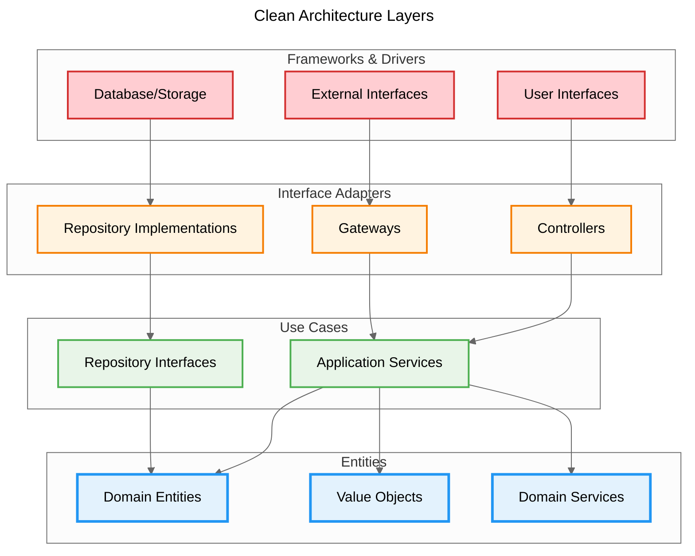

# Coding Guidelines

This document provides coding standards and best practices for the Project Manager codebase. These guidelines ensure consistency, maintainability, and quality across all packages.

**AI-Driven Development Focus**: These guidelines are specifically designed to reduce AI assistant failures and improve collaboration efficiency in AI-assisted development workflows.

## Table of Contents

1. [General Principles](#general-principles)
2. [Domain-Driven Design (DDD)](#domain-driven-design-ddd)
3. [TypeScript Guidelines](#typescript-guidelines)
4. [Testing Guidelines](#testing-guidelines)
5. [Error Handling](#error-handling)
6. [Documentation](#documentation)
7. [Code Organization](#code-organization)

## General Principles

### Clean Code

- Write code that clearly expresses intent
- Use meaningful names for variables, functions, and classes
- Keep functions small and focused on a single responsibility
- Avoid premature optimization
- Refactor regularly to maintain code quality

### SOLID Principles

- **Single Responsibility**: Each class/function should have one reason to change
- **Open/Closed**: Open for extension, closed for modification
- **Liskov Substitution**: Subtypes must be substitutable for their base types
- **Interface Segregation**: Depend on abstractions, not concretions
- **Dependency Inversion**: High-level modules should not depend on low-level modules

## Domain-Driven Design (DDD)

### Bounded Context

- Start with "Ticket Management" as the primary bounded context
- Design future features (user management, analytics) as separate contexts
- Maintain clear boundaries between contexts
- Define explicit interfaces for cross-context communication

### Entities

Entities are domain objects with identity that persists over time.

```typescript
// Good: Entity with encapsulated business logic
export class Ticket {
  private constructor(
    private readonly id: TicketId,
    private title: TicketTitle,
    private status: TicketStatus
  ) {}

  // Factory method for controlled creation
  static create(title: string, description: string): Ticket {
    const id = TicketId.generate();
    const titleVO = TicketTitle.create(title);
    const descriptionVO = TicketDescription.create(description);
    return new Ticket(id, titleVO, TicketStatus.pending());
  }

  // Business operations as methods
  startProgress(): void {
    if (!this.status.canTransitionTo('in_progress')) {
      throw new InvalidStateTransition();
    }
    this.status = TicketStatus.inProgress();
  }
}
```

**Guidelines:**

- Use private constructors with static factory methods
- Encapsulate all business rules within the entity
- Never expose setters that could break invariants
- Use method names that reflect business operations

### Value Objects

Value Objects are immutable objects without identity, defined by their attributes.

```typescript
// Good: Immutable value object with validation
export class TicketTitle {
  private constructor(private readonly value: string) {}

  static create(value: string): TicketTitle {
    const trimmed = value.trim();
    if (trimmed.length === 0) {
      throw new ValidationError('Title cannot be empty');
    }
    if (trimmed.length > 200) {
      throw new ValidationError('Title cannot exceed 200 characters');
    }
    return new TicketTitle(trimmed);
  }

  toString(): string {
    return this.value;
  }

  equals(other: TicketTitle): boolean {
    return this.value === other.value;
  }
}
```

**Guidelines:**

- Make all properties `readonly`
- Validate in the factory method or constructor
- Provide `equals()` method for value comparison
- Include `toString()` for easy serialization
- Never mutate - always return new instances

### Domain Services

Domain Services handle operations that don't naturally belong to a single entity.

```typescript
// Good: Stateless domain service
export class TicketPriorityService {
  calculatePriority(
    ticket: Ticket,
    projectDeadline: Date,
    dependencies: Ticket[]
  ): Priority {
    // Complex business logic that spans multiple entities
    const daysUntilDeadline = this.calculateDaysUntil(projectDeadline);
    const blockingCount = dependencies.filter(d => d.isBlocking()).length;

    if (daysUntilDeadline < 7 && blockingCount > 0) {
      return Priority.high();
    }
    // ... more business logic
  }
}
```

**Guidelines:**

- Keep services stateless
- Name services to clearly express their purpose
- Focus on domain logic, not infrastructure
- Use when logic doesn't belong to a single entity

### Repository Pattern

Repositories provide abstractions for data persistence while keeping domain objects pure.

```typescript
// Good: Domain-focused repository interface
export interface ITicketRepository {
  findById(id: TicketId): Promise<Ticket | null>;
  findByStatus(status: TicketStatus): Promise<Ticket[]>;
  save(ticket: Ticket): Promise<void>;
  remove(id: TicketId): Promise<void>;
}

// Infrastructure implementation (separate layer)
export class JsonTicketRepository implements ITicketRepository {
  async save(ticket: Ticket): Promise<void> {
    const data = this.mapper.toPersistence(ticket);
    await this.storage.write(data);
  }
}
```

**Guidelines:**

- Define interfaces in the domain layer
- Keep interfaces focused on domain operations
- Implement mapping logic in infrastructure layer
- Never expose persistence details to domain

### Aggregates

Aggregates define consistency boundaries and transaction scopes.

```typescript
// Good: Aggregate root with consistency enforcement
export class Project {
  private tickets: Ticket[] = [];

  addTicket(ticket: Ticket): void {
    // Enforce aggregate invariants
    if (this.tickets.length >= this.maxTickets) {
      throw new ProjectLimitExceeded();
    }
    if (this.isCompleted()) {
      throw new CannotAddToCompletedProject();
    }
    this.tickets.push(ticket);
  }
}
```

**Guidelines:**

- Start with single-entity aggregates
- Introduce multi-entity aggregates only when needed
- Enforce invariants at aggregate boundaries
- Keep aggregates small for better performance

## TypeScript Guidelines

### Naming Conventions

**Interface Naming**

- Do NOT use the "I" prefix for interfaces
- Use descriptive names that clearly indicate purpose
- Prefer noun phrases that describe the contract

```typescript
// Good: Clean interface names
interface UseCase<TRequest, TResponse> {
  execute(request: TRequest): Promise<TResponse>
}

interface TicketRepository {
  findById(id: TicketId): Promise<Ticket | null>
  save(ticket: Ticket): Promise<void>
}

// Bad: Hungarian notation with I prefix
interface IUseCase<TRequest, TResponse> {
  execute(request: TRequest): Promise<TResponse>
}

interface ITicketRepository {
  findById(id: TicketId): Promise<Ticket | null>
}
```

**Class Naming**

- Use PascalCase for class names
- Include meaningful suffixes for specific patterns
- Examples: `CreateTicketUseCase`, `JsonTicketRepository`, `TicketValidationError`

### Type Safety

```typescript
// Good: Leverage TypeScript's type system
type TicketStatus = 'pending' | 'in_progress' | 'completed';

interface CreateTicketDto {
  title: string;
  description: string;
  priority?: Priority;
}

// Use branded types for compile-time safety
type TicketId = string & { readonly brand: unique symbol };
```

### Strict Configuration

Always use strict TypeScript configuration:

```json
{
  "compilerOptions": {
    "strict": true,
    "noImplicitAny": true,
    "strictNullChecks": true,
    "strictFunctionTypes": true,
    "noImplicitThis": true,
    "noUnusedLocals": true,
    "noUnusedParameters": true,
    "noImplicitReturns": true,
    "noFallthroughCasesInSwitch": true
  }
}
```

## Clean Architecture

Clean Architecture provides the structural framework for implementing our Domain-Driven Design. It defines explicit layers with clear dependency rules that complement DDD concepts.

### Architectural Layers

Clean Architecture defines four main layers with strict dependency rules:



### Layer Responsibilities

**Entities Layer (Inner Layer)**

- Domain entities and value objects
- Enterprise business rules
- Core business logic
- No dependencies on outer layers

```typescript
// Good: Pure domain entity
export class Ticket {
  private constructor(props: TicketProps) {
    this.props = props;
  }

  static create(data: CreateTicketData): Ticket {
    const ticket = new Ticket({
      id: TicketId.create(),
      title: TicketTitle.create(data.title),
      status: TicketStatus.pending(),
      // ... other properties
    });
    return ticket;
  }

  // Business operations
  startProgress(): void {
    if (!this.status.canTransitionTo('in_progress')) {
      throw new InvalidStatusTransition();
    }
    this.status = TicketStatus.inProgress();
  }
}
```

**Use Cases Layer (Application Layer)**

- Application-specific business rules
- Orchestrates data flow between entities
- Depends only on inner layers and interfaces

```typescript
// Good: Use case with dependency inversion
@injectable()
export class TicketUseCase {
  constructor(
    @inject(TYPES.TicketRepository)
    private readonly ticketRepository: TicketRepository
  ) {}

  async createTicket(data: CreateTicketData): Promise<Ticket> {
    const ticket = Ticket.create(data);
    await this.ticketRepository.save(ticket);
    return ticket;
  }
}
```

**Interface Adapters Layer**

- Converts data between use cases and external systems
- Repository implementations
- External service adapters

```typescript
// Good: Repository implementation
@injectable()
export class JsonTicketRepository implements TicketRepository {
  async save(ticket: Ticket): Promise<void> {
    // Convert domain object to persistence format
    const ticketJson = TicketMapper.toPersistence(ticket);
    await this.writeToFile(ticketJson);
  }

  async findById(id: TicketId): Promise<Ticket | null> {
    const data = await this.readFromFile(id.value);
    return data ? TicketMapper.toDomain(data) : null;
  }
}
```

**Frameworks & Drivers Layer (Outer Layer)**

- External frameworks and tools
- CLI commands, web controllers
- Database drivers

```typescript
// Good: CLI command
export function createTicketCommand(): Command {
  return new Command('create')
    .action(async (title: string, description: string) => {
      const ticketUseCase = getTicketUseCase();
      const ticket = await ticketUseCase.createTicket({ title, description });
      console.log(formatTicket(ticket));
    });
}
```

### Dependency Rules

1. **Dependency Direction**: Dependencies point inward only
2. **Interface Segregation**: Outer layers depend on inner layer interfaces
3. **Stable Dependencies**: Inner layers are more stable than outer layers
4. **Framework Independence**: Business logic independent of frameworks

```typescript
// Good: Interface in inner layer
export interface TicketRepository {
  save(ticket: Ticket): Promise<void>;
  findById(id: TicketId): Promise<Ticket | null>;
}

// Good: Implementation in outer layer
export class JsonTicketRepository implements TicketRepository {
  // Implementation details
}

// Bad: Direct dependency on implementation
export class TicketUseCase {
  constructor(private repo: JsonTicketRepository) {} // ❌ Depends on concrete class
}

// Good: Dependency on interface
export class TicketUseCase {
  constructor(private repo: TicketRepository) {} // ✅ Depends on abstraction
}
```

### Integration with DDD

Clean Architecture layers map naturally to DDD concepts:

- **Entities Layer**: Domain entities, value objects, domain services
- **Use Cases Layer**: Application services, repository interfaces
- **Interface Adapters Layer**: Repository implementations, anti-corruption layers
- **Frameworks & Drivers Layer**: User interfaces, external APIs

### Common Mistakes to Avoid

**Violating Dependency Direction**

```typescript
// Bad: Inner layer depending on outer layer
export class Ticket {
  save(): void {
    const repo = new JsonTicketRepository(); // ❌ Domain depends on infrastructure
    repo.save(this);
  }
}

// Good: Outer layer depends on inner layer
export class TicketUseCase {
  constructor(private repo: TicketRepository) {} // ✅ Application depends on abstraction
}
```

**Mixing Layer Concerns**

```typescript
// Bad: Business logic in repository
export class JsonTicketRepository {
  async save(ticket: Ticket): Promise<void> {
    if (ticket.priority === 'high') {
      await this.sendUrgentNotification(); // ❌ Business logic in infrastructure
    }
    // ... save logic
  }
}

// Good: Business logic in domain
export class Ticket {
  markAsUrgent(): void {
    if (this.priority.isHigh()) {
      this.addDomainEvent(new UrgentTicketCreated(this.id)); // ✅ Business logic in domain
    }
  }
}
```

### Single Use Case Pattern

Following Clean Architecture principles, each use case should be implemented as a separate class with a single responsibility.

```typescript
// Good: Single responsibility use case
@injectable()
export class CreateTicketUseCase implements UseCase<CreateTicketRequest, CreateTicketResponse> {
  constructor(
    @inject(TicketRepositorySymbol)
    private readonly ticketRepository: TicketRepository
  ) {}

  async execute(request: CreateTicketRequest): Promise<CreateTicketResponse> {
    // Single focused responsibility
    const ticket = Ticket.create(request.toCreateTicketData())
    await this.ticketRepository.save(ticket)
    return TicketResponse.fromTicket(ticket) as CreateTicketResponse
  }
}

// Bad: Multiple responsibilities in one class
export class TicketUseCase {
  async createTicket(data: CreateTicketData): Promise<Ticket> { }
  async updateTicket(id: string, data: UpdateTicketData): Promise<Ticket> { }
  async deleteTicket(id: string): Promise<void> { }
  // ... many more methods
}
```

**Single Use Case Guidelines:**

- Each use case class handles exactly one business operation
- Use descriptive class names that clearly indicate the operation (e.g., `CreateTicketUseCase`)
- Implement `UseCase<TRequest, TResponse>` interface for consistency
- Use dependency injection for repository and service dependencies
- Follow the Command/Query Responsibility Segregation (CQRS) pattern

### Data Transfer Objects (DTOs)

DTOs facilitate clean data exchange between architectural layers:

```typescript
// Good: Layer-specific DTOs
export interface CreateTicketDto {
  title: string;
  description: string;
  priority?: 'high' | 'medium' | 'low';
  type?: 'feature' | 'bug' | 'task';
}

export interface TicketResponseDto {
  id: string;
  title: string;
  description: string;
  status: string;
  priority: string;
  type: string;
  createdAt: string;
  updatedAt: string;
}

// Good: DTO mapping in adapters
export class TicketDtoMapper {
  static toCreateData(dto: CreateTicketDto): CreateTicketData {
    return {
      title: dto.title,
      description: dto.description,
      priority: dto.priority || 'medium',
      type: dto.type || 'task'
    };
  }

  static toResponseDto(ticket: Ticket): TicketResponseDto {
    return {
      id: ticket.id.value,
      title: ticket.title.value,
      description: ticket.description.value,
      status: ticket.status.value,
      priority: ticket.priority.value,
      type: ticket.type,
      createdAt: ticket.createdAt.toISOString(),
      updatedAt: ticket.updatedAt.toISOString()
    };
  }
}
```

**DTO Guidelines:**

- Keep DTOs simple and serializable (plain objects)
- Use different DTOs for different layer boundaries (API vs Domain)
- Include only data needed for specific operations
- Validate DTOs at layer boundaries
- Use mapper classes for DTO transformations

### Testing Strategy

Test each layer independently:

```typescript
// Test domain layer in isolation
describe('Ticket', () => {
  it('should transition to in_progress when started', () => {
    const ticket = Ticket.create({ title: 'Test', description: 'Test' });
    ticket.startProgress();
    expect(ticket.status.value).toBe('in_progress');
  });
});

// Test use case with mocked repository
describe('TicketUseCase', () => {
  it('should create and save ticket', async () => {
    const mockRepo: TicketRepository = { save: vi.fn() };
    const useCase = new TicketUseCase(mockRepo);

    await useCase.createTicket({ title: 'Test', description: 'Test' });

    expect(vi.mocked(mockRepo.save)).toHaveBeenCalledWith(expect.any(Ticket));
  });
});
```

## Testing Guidelines

### Test-Driven Development (TDD)

1. Write test first (Red)
2. Write minimal code to pass (Green)
3. Refactor while keeping tests green

```typescript
// Good: Descriptive test with AAA pattern
describe('Ticket', () => {
  describe('create', () => {
    it('should create a ticket with valid data', () => {
      // Arrange
      const title = 'Fix login bug';
      const description = 'Users cannot login with email';

      // Act
      const ticket = Ticket.create(title, description);

      // Assert
      expect(ticket).toBeDefined();
      expect(ticket.getTitle()).toBe(title);
      expect(ticket.getStatus()).toBe('pending');
    });

    it('should throw when title is empty', () => {
      // Arrange
      const emptyTitle = '';
      const description = 'Valid description';

      // Act & Assert
      expect(() => {
        Ticket.create(emptyTitle, description);
      }).toThrow(ValidationError);
    });
  });
});
```

### Testing Best Practices

- Test behavior, not implementation
- Use descriptive test names that explain the scenario
- Follow AAA pattern: Arrange, Act, Assert
- Test edge cases and error conditions
- Keep tests independent and isolated
- Use test doubles (mocks, stubs) sparingly

## Error Handling

### Custom Error Classes

```typescript
// Good: Domain-specific error with context
export class TicketValidationError extends Error {
  constructor(
    message: string,
    public readonly field: string,
    public readonly value: unknown
  ) {
    super(message);
    this.name = 'TicketValidationError';
  }
}
```

### Error Handling Patterns

```typescript
// Good: Explicit error handling
async function updateTicket(id: string, data: UpdateTicketDto): Promise<Result<Ticket, Error>> {
  try {
    const ticket = await repository.findById(id);
    if (!ticket) {
      return Result.fail(new TicketNotFoundError(id));
    }

    ticket.update(data);
    await repository.save(ticket);

    return Result.ok(ticket);
  } catch (error) {
    if (error instanceof ValidationError) {
      return Result.fail(error);
    }
    // Log unexpected errors
    logger.error('Unexpected error updating ticket', { error, id });
    return Result.fail(new UnexpectedError());
  }
}
```

## Documentation

### Code Comments

```typescript
/**
 * Represents a development task or issue in the project management system.
 *
 * Tickets follow a defined lifecycle: pending -> in_progress -> completed
 * and enforce business rules for valid state transitions.
 *
 * @example
 * const ticket = Ticket.create('Fix login bug', 'Users cannot login');
 * ticket.startProgress();
 * ticket.complete();
 */
export class Ticket {
  // Implementation
}
```

### Documentation Guidelines

- Document "why" not "what" in comments
- Use JSDoc for public APIs
- Keep documentation close to code
- Update documentation with code changes
- Include examples for complex usage

## Code Organization

### Package Structure (Clean Architecture)

```
project-manager/
├── apps/                    # Applications (final deliverables)
│   ├── cli/                 # CLI application
│   └── mcp-server/          # MCP server for AI integration
└── packages/                # Libraries (Clean Architecture layers)
    ├── domain/              # Domain Layer - Core business logic
    │   ├── entities/        # Rich domain entities
    │   ├── value-objects/   # Immutable value objects
    │   └── services/        # Domain services
    ├── application/         # Application Layer - Use cases
    │   ├── usecases/        # Single-responsibility use cases
    │   ├── repositories/    # Repository interfaces
    │   └── factories/       # Use case factories
    ├── infrastructure/      # Infrastructure Layer - External concerns
    │   ├── adapters/        # Repository implementations
    │   ├── config/          # Configuration implementations
    │   └── types/           # Infrastructure-specific types
    ├── sdk/                 # SDK Layer - Facade pattern
    │   └── src/             # Unified API for external consumers
    ├── base/                # Foundation Layer - Shared infrastructure
    │   ├── configuration/   # Configuration framework
    │   └── types/           # Common types and utilities
    └── shared/              # Shared utilities
```

### Import Organization

```typescript
// 1. Node.js built-ins
import { readFile } from 'fs/promises';
import { join } from 'path';

// 2. External dependencies
import { injectable, inject } from 'inversify';
import { z } from 'zod';

// 3. Internal packages (Clean Architecture layers)
import { Ticket, TicketStatus } from '@project-manager/domain';
import { CreateTicketUseCase } from '@project-manager/application';
import { JsonTicketRepository } from '@project-manager/infrastructure';

// 4. Relative imports
import { validateInput } from './validators';
import type { Config } from './types';
```

### Import Extensions

**TypeScript Import Extension Guidelines**

This project uses `moduleResolution: "Bundler"` with `allowImportingTsExtensions: true` which allows `.ts` extensions:

**Standard Pattern (All Files)**

Use `.ts` extensions in import statements for TypeScript files:

```typescript
// ✅ Good: Use .ts extension for TypeScript imports
import { createTicket } from './ticket-service.ts'
import { TicketRepository } from '../repositories/ticket-repository.ts'

// ❌ Bad: Missing extension or .js extension
import { createTicket } from './ticket-service'
import { TicketRepository } from '../repositories/ticket-repository.js'
```

**Development Wrapper Exception**

Development wrapper files (e.g., `*-dev.ts`) that use tsx for direct TypeScript execution should import `.ts` files:

```typescript
// Development wrapper pattern: packages/*/src/bin/*-dev.ts
#!/usr/bin/env tsx

// Force development environment
process.env.NODE_ENV = 'development'

// ✅ Good: Import .ts for direct tsx execution
import './main-file.ts'

// ❌ Bad: .js doesn't exist during development
import './main-file.ts'
```

**Rationale**

- **ES Modules**: Node.js requires explicit extensions for ES module resolution
- **TypeScript Bundler Mode**: Aligns with bundler expectations for import paths
- **Development Efficiency**: tsx can execute `.ts` files directly in development
- **Production Compatibility**: Compiled JavaScript uses `.js` extensions as expected
- **AI Assistant Reliability**: Consistent `.ts` extension pattern reduces AI confusion and import resolution failures during development tasks

### File Organization Anti-patterns

**Avoid index.ts Files (Except Package Entry Points)**

Do NOT create `index.ts` files in internal directories as they create maintenance overhead and token waste in AI-driven development.

**Problems with index.ts files:**

- **Maintenance Burden**: Every new file requires updating multiple index files
- **Token Waste**: AI tools process unnecessary re-export code
- **AI Task Failure**: AI assistants frequently fail to maintain index files correctly, leading to broken imports
- **Circular Dependencies**: Can create complex dependency chains
- **Build Complexity**: Increases build time and complexity
- **Refactoring Friction**: Makes moving files more difficult

```typescript
// ❌ Bad: Internal index.ts files
// packages/core/src/application/usecases/index.ts
export * from './create-ticket.usecase.ts'
export * from './get-ticket-by-id.usecase.ts'
export * from './update-ticket-status.usecase.ts'
// ... 15 more lines to maintain

// ✅ Good: Direct imports from specific files
import { CreateTicketUseCase } from './usecases/create-ticket.ts'
import { GetTicketByIdUseCase } from './usecases/get-ticket-by-id.ts'
```

**Exceptions (When index.ts is acceptable):**

- **Package Entry Points**: Main package exports (`packages/core/src/index.ts`)
- **Public API Boundaries**: When creating a deliberate public API surface
- **Large Utility Collections**: When you have 20+ related utilities that are commonly used together

**Avoid Redundant File Suffixes**

Do NOT use redundant suffixes when the directory context already provides the information.

**Problems with redundant suffixes:**

- **Token Waste**: AI tools process unnecessary repetitive text
- **Verbose Paths**: Longer import paths and file names
- **Redundant Information**: Directory already indicates the file type
- **Maintenance Overhead**: More text to type and maintain

```typescript
// ❌ Bad: Redundant suffixes
// usecases/create-ticket.usecase.ts
// usecases/get-ticket-by-id.usecase.ts
// requests/create-ticket.request.ts
// responses/create-ticket.response.ts

// ✅ Good: Context-aware naming
// usecases/create-ticket.ts
// usecases/get-ticket-by-id.ts
// requests/create-ticket.ts
// responses/create-ticket.ts
```

**Benefits:**

- **Reduced Token Usage**: Shorter file names and import paths
- **Better Readability**: Less visual noise in import statements
- **Faster Development**: Less typing and shorter auto-complete results
- **Cleaner File Trees**: Directory structure is more scannable

## Continuous Improvement

These guidelines are living documentation. As the project evolves:

1. Update guidelines based on team experience
2. Add examples from actual code
3. Document decisions and rationale
4. Keep guidelines practical and actionable
5. Review and refine regularly

Remember: Guidelines are meant to help, not hinder. Use judgment and prioritize code clarity and maintainability over strict adherence to rules.
