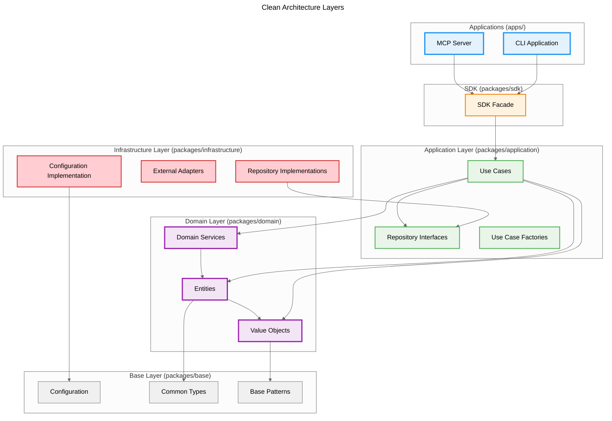

# ARCHITECTURE REFERENCE

## System Architecture Overview

### Core Purpose

Project Manager is a local-first ticket management system designed to enable effective collaboration between developers and AI assistants through issue-based development workflows.

### Architectural Principles

**Design Philosophy**

- **Clean Architecture**: Domain-driven design with strict layer separation and dependency inversion
- **Local-First Architecture**: All core functionality works offline with local data storage
- **AI-Driven Development**: Built specifically to support AI-assisted development workflows
- **Issue-Based Development**: Structured around tickets, epics, and implementation planning
- **Secure-by-Design**: Security considerations integrated into every architectural decision
- **Standards-First Approach**: Adopt industry standards over custom implementations
- **CLI-First Interface**: Command-line interface as the foundation for all other interfaces

**Quality Principles**

- **Shift-Left Development**: Early quality assurance through pre-implementation reviews
- **Document-Driven Development**: Specifications and design decisions captured before implementation
- **Test-Driven Development**: Comprehensive testing strategy from unit to integration levels
- **Domain-Driven Design**: Clear domain model with ubiquitous language
- **Separation of Concerns**: Clear distinction between architectural decisions and implementation status
- **Dependency Inversion**: All dependencies point inward toward the domain layer
- **Single Responsibility**: Each layer and component has one reason to change

### System Components


**Key Architectural Patterns**

- **CLI-First Design**: CLI serves as the primary interface and can launch/control other components like MCP server
- **Core System**: Contains business logic and shared configuration, ensuring consistent behavior across all interfaces
- **Actor-Based Interactions**: Human users, AI assistants, and automation agents interact through appropriate interfaces
- **Service-Oriented Architecture**: Core system coordinates various services (storage, configuration, logging, synchronization)
- **External Integration**: Synchronization services provide controlled access to external project management tools

**Interface Relationships**

- **CLI → Core**: Primary interface accessing core business logic
- **CLI → TUI**: CLI can launch Terminal UI (e.g., `pm --tui`)
- **CLI → MCP**: CLI can launch and manage MCP server (e.g., `pm --mcp`)
- **SDK → Core**: Direct access to core for programmatic use
- Core maintains configuration and state, ensuring consistent behavior across all access patterns

## Clean Architecture Implementation

### Layer Structure

The system implements Clean Architecture with strict dependency rules and clear separation of concerns:



### Package Structure

```
packages/
├── domain/              # Domain Layer - Core business logic
│   ├── entities/        # Rich domain entities with business rules
│   ├── value-objects/   # Immutable value objects
│   └── services/        # Domain services for cross-entity operations
├── application/         # Application Layer - Use cases and interfaces
│   ├── usecases/        # Single-responsibility use cases
│   ├── repositories/    # Repository interfaces
│   └── factories/       # Use case factory patterns
├── infrastructure/      # Infrastructure Layer - External concerns
│   ├── adapters/        # Repository implementations
│   ├── config/          # Configuration implementations
│   └── types/           # Infrastructure-specific types
├── sdk/                 # SDK Layer - Facade pattern
│   └── src/             # Unified API for external consumers
├── base/                # Foundation Layer - Shared infrastructure
│   ├── configuration/   # Configuration framework
│   ├── types/           # Common types and utilities
│   └── patterns/        # Base patterns and abstractions
and shared/              # Shared utilities
apps/
├── cli/                 # CLI Application
└── mcp-server/          # MCP Server Application
```

### Dependency Rules

1. **Domain Layer** (`packages/domain`): No dependencies on other layers
2. **Application Layer** (`packages/application`): Depends only on Domain and Base
3. **Infrastructure Layer** (`packages/infrastructure`): Implements Application interfaces
4. **SDK Layer** (`packages/sdk`): Facade over Application layer
5. **Applications** (`apps/`): Use SDK or Application layer directly

## Component Architecture

### Core System Components

**Core Logic**

- Business rule enforcement
- Entity lifecycle management
- Event sourcing and audit logging
- Cross-cutting feature composition

**Storage Service**

- File-based persistence layer
- JSON serialization/deserialization
- Atomic write operations with lock files
- Migration support for schema changes

**Configuration Service**

- XDG Base Directory compliance
- Environment variable resolution
- Cascading configuration (global → project → local)
- Settings validation and defaults

**Sync Service**

- External system adapters (GitHub, Jira, Linear)
- Bidirectional data mapping
- Conflict detection and resolution
- Privacy-aware filtering

### Interface Components

**CLI Interface**

- Command structure using Commander.js
- Interactive and non-interactive modes
- Structured output formats (JSON, plain text)
- Progress reporting for long operations

**MCP Server**

- Model Context Protocol implementation
- RESTful API endpoints
- WebSocket support for real-time updates
- Authentication and authorization

**Terminal UI (TUI)**

- Enhanced interactive experience
- Launched via CLI (`pm --tui`)
- Rich visual interface for complex operations

**SDK/Libraries**

- Direct programmatic access to core business logic
- Language-specific implementations
- Consistent API across platforms

## Data Model and Storage

### Domain-Driven Design Approach

The system follows Domain-Driven Design principles to model complex business logic:

**Bounded Context**

- Starting with a single "Ticket Management" bounded context
- Future expansions (user management, analytics) designed as separate contexts
- Clear boundaries prevent concept pollution across domains

**DDD Building Blocks**

1. **Entities**: Objects with identity and lifecycle (Ticket, Epic, Project)
   - Encapsulate business rules and invariants
   - Use factory methods for controlled creation
   - Maintain clear identity throughout lifecycle

2. **Value Objects**: Immutable objects without identity
   - Replace primitive types with domain-specific types
   - Encapsulate validation and business constraints
   - Examples: Status, Priority, Type, future: TicketTitle, Description

3. **Domain Services**: Stateless operations spanning multiple entities
   - Handle cross-entity calculations and operations
   - Keep infrastructure concerns separate
   - Examples: Statistics calculation, progress tracking

4. **Repositories**: Abstractions for persistence
   - Shield domain from infrastructure details
   - Handle domain object reconstruction
   - Provide domain-focused query methods

5. **Aggregates**: Consistency boundaries
   - Currently treating entities as independent aggregate roots
   - Introduce when transactional consistency needed across entities

For detailed implementation guidelines and code examples, see [Coding Guidelines](../guides/coding-guidelines.md).

### Domain Model Relationships


### Core Domain Entities

**Project**

- Contains configuration and metadata
- Manages tickets, epics, and roadmaps
- Tracks contributors (human and AI)

**Epic**

- Groups related tickets into larger initiatives
- Defines business goals and success metrics
- Tracks progress across multiple tickets

**Ticket (Issue)**

- Represents a single development task
- Contains background, purpose, and acceptance criteria
- Tracks status, priority, and assignments
- Links to implementation plans and design proposals

**Sub-Ticket**

- Granular work items within tickets
- Enables detailed task decomposition
- Supports full feature composition

**Implementation Plan**

- Documents technical approach for tickets
- Captures architectural decisions and alternatives
- Enables pre-implementation review and validation

### Aggregate Boundaries

**Project Aggregate**

- **Root**: Project entity
- **Scope**: Project configuration, metadata, statistics
- **Consistency**: Manages overall project state

**Epic Aggregate**

- **Root**: Epic entity
- **Scope**: Epic details, success criteria, progress tracking
- **Consistency**: Epic-level business rules and progress

**Ticket Aggregate**

- **Root**: Ticket entity
- **Scope**: Ticket details, acceptance criteria, implementation plans, tasks
- **Consistency**: Ticket-level business rules and state transitions

**Sub-Ticket Aggregate**

- **Root**: Sub-Ticket entity
- **Scope**: Sub-task details, dependencies, implementation plans
- **Consistency**: Sub-task level business rules and state transitions

### Cross-Cutting Features

**Feature Set Definitions**

- **Commentable**: Enables timestamped text-based discussions on any entity
- **Attachable**: Allows file attachments to any entity
- **Taskable**: Provides checkbox-style sub-task management
- **Labelable**: Supports categorization through colored tags
- **Relatable**: Defines relationships between entities (blocks, depends_on, relates_to, duplicates)

**Feature Usage Patterns**

All entities support the complete set of cross-cutting features, but are typically used at different levels of granularity:

**EPIC Level**

- **Comments**: Strategic discussions, stakeholder feedback, business requirements
- **Attachments**: Requirements documents, business cases, market research
- **Tasks**: Milestones, major deliverables, phase gates, stakeholder approvals
- **Labels**: Business domains, strategic themes, budget categories
- **Relationships**: Epic dependencies, business process flows

**TICKET Level**

- **Comments**: Technical discussions, implementation notes, progress updates
- **Attachments**: Design documents, screenshots, test data, specifications
- **Tasks**: Implementation steps, testing checklist, review items
- **Labels**: Technical components, skill requirements, effort estimates
- **Relationships**: Feature dependencies, technical constraints, blocking issues

**SUB_TICKET Level**

- **Comments**: Detailed technical notes, code review feedback, troubleshooting
- **Attachments**: Code snippets, log files, specific test cases, patches
- **Tasks**: Granular implementation steps, unit test cases, code review items
- **Labels**: Code modules, specific technologies, detailed classifications
- **Relationships**: Implementation dependencies, code-level constraints

### Value Objects

- **Status**: pending, in_progress, completed, archived
- **Priority**: high, medium, low
- **Type**: feature, bug, task, epic
- **Privacy**: local-only, shareable, public

### File System Structure

Following XDG Base Directory specification:

```
# Home directory structure
~/.config/project-manager/     # XDG Base Directory compliance
├── config.json              # Global configuration
├── projects/                # Project data
│   ├── {project-id}/       # Individual project
│   │   ├── project.json   # Project metadata
│   │   ├── tickets.json   # Ticket collection
│   │   ├── epics.json     # Epic collection
│   │   └── events.jsonl   # Event log (append-only)
│   └── index.json          # Cross-project index
├── ai/                      # AI Integration data
│   ├── sessions/           # AI session data
│   └── contexts/           # Cached contexts
└── sync/                    # External sync data
    ├── mappings/           # Entity mappings
    └── cache/              # External data cache

~/.cache/project-manager/      # XDG Base Directory compliance
└── [cache files]

~/.local/share/project-manager/ # XDG Base Directory compliance
└── [user data]
```

### Data Format Specifications

**JSON Schema Structure**

```typescript
interface Ticket {
  id: string;
  title: string;
  description: string;
  status: 'pending' | 'in_progress' | 'completed' | 'archived';
  priority: 'high' | 'medium' | 'low';
  type: 'feature' | 'bug' | 'task';
  privacy: 'local-only' | 'shareable' | 'public';
  // Cross-cutting features composed as needed
  comments?: Comment[];
  attachments?: Attachment[];
  tasks?: Task[];
  labels?: Label[];
  relationships?: Relationship[];
}
```

**Storage Operations**

*Write Operations*

- Atomic writes using temporary files and rename
- File-level locking for concurrent access
- Automatic backup before modifications
- Transaction log for recovery

*Read Operations*

- In-memory caching with TTL
- Lazy loading for large datasets
- Index-based quick lookups
- Stream processing for event logs

**Data Storage Philosophy**

- **Local-First**: All data stored locally for offline operation and data sovereignty
- **Standards Compliance**: Following XDG Base Directory specification for cross-platform compatibility
- **Version Control Friendly**: JSON and Markdown formats work well with Git
- **Privacy by Design**: Clear separation of local-only and shareable data
- **Version Control**: Snapshot-based storage initially, with future migration to diff-based storage
- **Co-authorship Tracking**: Record both AI agent and human instructor for all AI operations

## Integration Patterns

### CLI-First Data Access

Following the CLI-first architecture principle:

- **CLI**: Direct access to all data contexts
- **MCP Server**: AI-focused data access, launched via CLI
- **SDK**: Direct programmatic access to core business logic
- **TUI**: Interactive data access, launched via CLI

### MCP Server Integration

**Core Services**

- Ticket management operations
- Project context retrieval
- AI-assisted validation workflows
- Language translation services

**API Endpoints**

- CRUD operations for tickets and epics
- Search and filtering capabilities
- Status reporting and analytics
- Template management

### External System Integration

**Integration Philosophy**

- **Tool-Based Sync**: No direct API integration, maintaining system independence
- **User Control**: All synchronization requires explicit user action
- **Privacy Preservation**: Local-only data never leaves the system
- **Extensibility**: Plugin architecture for adding new integrations

**Synchronization Strategy**

- External tool-based synchronization (not direct sync)
- User-driven conflict resolution with AI assistance
- Selective sharing based on privacy settings
- Audit trail for all changes

**Data Mapping**: Anti-corruption layer pattern

- Internal domain model protected from external changes
- Mapping layer for external system integration
- Cached external data for offline operation

**Supported Systems**

- GitHub Issues
- Jira
- Linear
- Extensible plugin architecture

### AI Integration

**Context Management**: AI session and context storage

- Compressed context data for AI operations
- Session-based context isolation
- Automatic context cleanup and expiration

**Operation Tracking**: Co-authorship and audit trail

- AI operation attribution and risk assessment
- User confirmation for high-risk operations
- Operation outcome tracking

## Security Architecture

### Local Security

- File system permissions for data protection
- Secure storage of API keys and credentials
- Audit logging for all operations
- Privacy controls for sensitive information
- **AI Operation Safeguards**: User confirmation steps before AI executes destructive operations
- **Operation Risk Assessment**: Categorize operations by risk level (high/medium/low) to determine appropriate safeguards

### Access Control

**File Permissions**

- User-only access for sensitive data (0600)
- Read-only for shared configuration (0644)
- Directory restrictions (0700)

**API Security**

- JWT token validation
- Rate limiting per user/IP
- Request signing for integrity
- Audit logging for all operations

### Data Protection

**Sensitive Data Handling**

- Credential encryption at rest
- Secure credential storage using OS keychain
- Memory scrubbing for sensitive data
- No logging of sensitive information

### Integration Security (Standards Adoption)

- OAuth 2.0 for external system authentication (industry standard)
- JWT tokens for secure API communication
- API key rotation and management
- Rate limiting and throttling
- Data sanitization and validation
- OWASP guidelines compliance for security practices

## Technology Stack

### Core Technologies and Rationale

**Runtime Environment**

- **Node.js**: Chosen for its ubiquity in developer tooling and excellent CLI support
- **TypeScript**: Provides type safety and better IDE support for large codebases
- **pnpm**: Monorepo package management with workspaces

**CLI Framework (CLI-First Implementation)**

- **Commander.js**: Command structure following POSIX and GNU conventions
- **tsx**: Direct TypeScript execution for development efficiency
- **Chalk**: Terminal styling and structured output

**Configuration Management (Standards Adoption)**

- **XDG Base Directory**: Specification for file locations
- **JSON**: Format for structured configuration
- **Environment Variables**: Support following dotenv standards

**API Design (Standards Adoption)**

- **RESTful Principles**: With OpenAPI 3.0 specification
- **JSON**: Response format
- **Standard HTTP Status Codes**: For consistent error handling

**Code Quality (Standards Adoption)**

- **ESLint/Prettier**: For JS/TS code style
- **Conventional Commits**: For commit messages
- **Semantic Versioning**: SemVer 2.0.0 for releases

**Storage**

- **JSON Files**: For structured data
- **CommonMark**: For Markdown documentation
- **File-based Templates**: For code generation

**AI Integration**

- **Model Context Protocol (MCP)**: Server implementation (mandatory standard)
- **Multi-Provider Support**: For various AI systems
- **Language Bridging**: Capabilities for non-English speakers
- **AI Resource Management**: Optional token usage and cost tracking
- **Git-style Co-authorship**: Model for AI operations
- **AI-Optional Design**: All basic features work without AI

**Key Technology Decisions**

- **Local-First Storage**: JSON files provide simplicity and version control compatibility
- **Model Context Protocol**: Industry standard for AI integration
- **Conventional Commits**: Enables automated versioning and changelog generation

## Implementation Guidelines

### Development Approach

- **Domain-Driven Design**: Focus on core domain concepts
- **Test-Driven Development**: Tests before implementation
- **Document-Driven Development**: Clear specifications
- **AI-Assisted Development**: Leverage AI for efficiency
- **Standards-First Development**: Adopt industry standards over custom implementations
- **CLI-First Implementation**: Build CLI as primary interface to core business logic

### Schema Evolution

**Version Management**: Semantic versioning for data schemas

- Migration scripts for schema changes
- Backward compatibility maintenance
- Forward compatibility where possible

**Field Addition**: Additive changes preferred

- Optional fields for new features
- Default values for missing fields
- Graceful degradation for older clients

### Performance Considerations

**Optimization Strategies**

- Lazy loading for large collections
- Index files for quick lookups
- Incremental updates where possible
- Background sync operations

**Resource Management**

- File handle pooling
- Memory usage monitoring
- Disk space management
- Network request throttling

### Documentation and Decision Tracking

- **Architecture Decision Records (ADRs)**: Document significant architectural decisions
- **Decision-Implementation Separation**: ADRs track decisions, not implementation status
- **Implementation Tracking**: Use project management tools for implementation lifecycle
- **Clear Documentation Hierarchy**: Separate concerns across appropriate documents

### Code Organization

```
packages/
├── core/               # Business logic
├── cli/                # CLI implementation
├── mcp-server/         # MCP server
├── sdk/                # SDK library
└── shared/             # Shared utilities
```

### Quality Assurance

- Comprehensive test coverage (unit, integration, E2E)
- Static analysis and linting
- Security scanning and vulnerability assessment
- Performance monitoring and optimization

## Implementation Status

### Clean Architecture Migration Complete ✅

The system has successfully completed its migration to Clean Architecture:

**Architecture Achievements**

- ✅ **Domain Layer**: Rich domain models with encapsulated business logic
  - Ticket, TicketId, TicketTitle, TicketDescription, TicketStatus, TicketPriority
  - Domain services for cross-entity operations
  - No external dependencies

- ✅ **Application Layer**: Use cases following single responsibility principle
  - 15+ use cases implemented (CreateTicket, GetTicketById, UpdateTicketStatus, etc.)
  - Repository interfaces defining domain contracts
  - Use case factory pattern for dependency injection

- ✅ **Infrastructure Layer**: Repository implementations and external adapters
  - JsonTicketRepository with file-based persistence
  - XDG-compliant configuration management
  - Proper dependency inversion implementation

- ✅ **SDK Layer**: Facade pattern for unified API access
  - ProjectManagerSDK with clean external interface
  - Dependency injection container for use case access
  - Type-safe request/response DTOs

- ✅ **Applications**: CLI and MCP server as separate applications
  - CLI application in `apps/cli` with service layer integration
  - MCP server in `apps/mcp-server` with 9 AI integration tools
  - Hot reload development workflow

**Test Coverage**

- ✅ **913 out of 915 tests passing** (99.8% success rate)
- ✅ Comprehensive unit tests for all layers
- ✅ Integration tests for repository implementations
- ✅ End-to-end workflow validation

**Quality Metrics**

- ✅ **Dependency Direction**: All dependencies point inward toward domain
- ✅ **Layer Isolation**: No circular dependencies between layers
- ✅ **Interface Segregation**: Clean contracts between layers
- ✅ **Single Responsibility**: Each component has one reason to change

### Development Tools

- ✅ **Monorepo Structure**: pnpm workspaces with proper package organization
- ✅ **TypeScript Configuration**: Strict type checking with custom conditions
- ✅ **Hot Reload**: Development efficiency with tsx and file watching
- ✅ **Build Pipeline**: Vite-based building with proper externalization
- ✅ **Testing**: Vitest with comprehensive test coverage

## Future Considerations

### Scalability

- Plugin architecture for extensibility
- Multi-project support
- Team collaboration features
- Enterprise-grade security

### User Experience (Phased Interface Implementation)

**Phase 1: CLI-First Implementation**

- Command-line interface as primary interaction method
- Structured output formats (JSON, plain text) for programmatic use
- Interactive and non-interactive modes

**Phase 2: Programmatic Interfaces**

- Model Context Protocol (MCP) server for AI integration
- RESTful API exposing core functionality
- SDK/libraries for common programming languages

**Phase 3: Additional User Interfaces (As Needed)**

- Terminal User Interface (TUI) for enhanced interactive experience
- IDE extensions (VSCode, IntelliJ) for integrated workflows
- Web UI for team collaboration and visualization
- Other interfaces based on user feedback and adoption patterns

### AI Resource Management (Optional)

- Token usage monitoring dashboard
- Cross-project resource allocation
- Cost optimization algorithms
- Automatic context compression
- Model selection strategies
- Rate limit management
- Budget tracking and alerts
